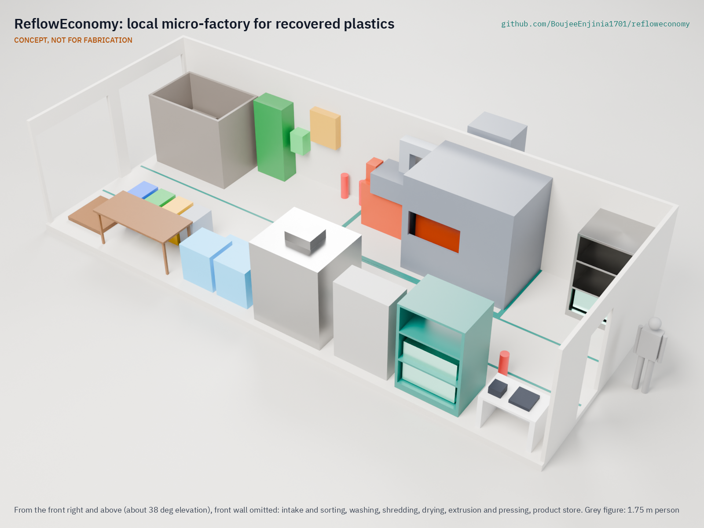

# ReflowEconomy

  

**Area:** Circular Materials · **TRL:** 3 of 9 (proof of concept on paper; TRL 4 on hold by Amish's instruction)

Open playbook for local micro-factories that recover and remanufacture materials safely at small scale: a feasibility matrix by material, process recipes, a micro-factory economics model, safety rules, and a material passport data standard so buyers can trust recycled feedstock. Machines live in their own repos. The guiding principle is to recover and remanufacture locally and export only what needs industrial refining.

[Interactive 3D model](media/viewer.html) · [Floor plan GA (PDF)](cad/drawings/RFE-DWG-001.pdf) · [Calculation note](docs/04-calcs/01-sizing.md) · [Concept blueprint (PDF)](media/concept-blueprint.pdf) · [Material flow](media/flow.png) · [Review note](docs/REVIEW.md)

## Concept rationale

Most of the value in collected waste is lost at the first step: scrap is baled and shipped away, or burned to get at the metal. ReflowEconomy starts from the other end. It asks which materials a small team can recover and remanufacture safely with open machines, and which must leave for industrial refining, and it writes the answer down as a playbook: a feasibility matrix, process recipes, an economics model, safety rules and a material passport, all tied to one reference micro-factory that has been sized on paper.

The playbook is open and garage-buildable because the people who would run it are cooperatives and small workshops, not plant operators. The machines are open designs that a local fabricator can build and repair, the layout fits a rented shed of about 60 m², the line runs on a single-phase supply, and the economics model is a CSV file that an operator can change to local prices. Anyone can copy it, adapt it and publish what they learn.

## Burning platform

The World Bank estimated 2.01 billion tonnes of municipal solid waste in 2016, rising to about 3.40 billion tonnes by 2050, with the fastest growth in lower-income regions ([World Bank, *What a Waste 2.0*, 2018](https://datatopics.worldbank.org/what-a-waste/)). Only about 9 % of plastic waste was recycled worldwide in 2019 after losses ([OECD, *Global Plastics Outlook*, 2022](https://www.oecd.org/en/publications/global-plastics-outlook_de747aef-en.html)).

Where value is recovered, it is often recovered at a cost to health. The world generated 62 million tonnes of e-waste in 2022, and only 22.3 % was documented as formally collected and recycled ([ITU and UNITAR, *Global E-waste Monitor 2024*](https://ewastemonitor.info/the-global-e-waste-monitor-2024/)). WHO reports that up to 12.9 million women work in the informal waste sector, where unsafe recovery can expose workers to lead, mercury and dioxins ([WHO, *Children and digital dumpsites*, 2021](https://www.who.int/publications/i/item/9789240023901)).

## Where it could be used

### By industry

| Industry | Use |
| --- | --- |
| Waste-picker cooperatives | Move from selling baled scrap to selling clean flake and products, with a passport that earns a better price |
| Municipal solid waste services | A permittable model for local recovery that reduces open burning and landfill volume |
| Construction and furniture making | Local supply of recycled HDPE and PP sheets and beams of known grade and origin |
| Manufacturers buying recycled feedstock | Clean PET flake with a traceable record and a recycled content statement |
| Metal and e-waste refiners | Correctly identified, packed export lots of metals, boards and cells from small sites |
| Makerspaces and technical schools | A reference layout and recipes for teaching safe small-scale recycling |

### By country or region

| Country or region | Why it matters there |
| --- | --- |
| Brazil | The National Solid Waste Policy (Law 12.305 of 2010) directs municipalities to prioritize selective collection with waste-picker cooperatives and to fund them ([Lei 12.305/2010](https://www.planalto.gov.br/ccivil_03/_ato2007-2010/2010/lei/l12305.htm)); a cooperative that also processes keeps more of the value |
| East Asia and Pacific | Higher-income OECD countries have exported plastic waste to lower-income countries in this region for decades ([Brooks, Wang and Jambeck, *Science Advances*, 2018](https://doi.org/10.1126/sciadv.aat0131)); local processing of their own waste is the alternative to importing others' |
| West Africa (for example Ghana) | Informal e-waste recovery by open burning and acid leaching harms workers and children ([WHO, 2021](https://www.who.int/publications/i/item/9789240023901)); the playbook's rule is to dismantle and sort locally and export boards and cells to licensed refiners |
| India | The Solid Waste Management Rules, 2016 direct local bodies to recognize organizations of waste pickers, issue identity cards and integrate them into door-to-door collection ([MoEFCC, SWM Rules 2016, Rule 15](https://cdnbbsr.s3waas.gov.in/s30f46c64b74a6c964c674853a89796c8e/uploads/2024/07/20240710555191345.pdf)); organized groups of waste pickers could add washing, flaking and pressing on a single-phase supply |
| European Union | Digital product passports under the Ecodesign for Sustainable Products Regulation ([EU 2024/1781](https://eur-lex.europa.eu/eli/reg/2024/1781/oj)) will raise the bar for traceable recycled content; a simple open passport helps small recyclers and repair workshops keep up |

## What sparked the idea

The starting point was China's ban on imports of most plastic waste, which took effect in 2018. China had taken in a cumulative 45 % of the world's plastic waste imports since 1992, and Brooks, Wang and Jambeck estimated that about 111 million tonnes of plastic waste would be displaced by 2030 ([*Science Advances*, 2018](https://doi.org/10.1126/sciadv.aat0131)). The same study found that 89 % of historical exports were polyethylene, polypropylene and PET, the three polymers that small open machines handle best. Countries that had relied on shipping scrap abroad were left holding material they had never learned to process. ReflowEconomy takes that lesson at the smallest useful scale: recover and remanufacture the common polymers locally, and export only what needs industrial refining.

## Problem

Smaller and lower-income countries export scrap and import finished goods, losing the value of their own materials. Most recycling know-how assumes industrial scale, and unsafe informal recovery (open burning, acid leaching of e-waste) harms workers and communities.

## Concept

The playbook is built around one reference design: a plastics micro-factory on 59.4 m² (a rented shed, or two 40 ft container footprints where no shed is available) with a central aisle, intake and sorting, washing and float-sink, an enclosed shredder, drying, a hot zone with an extruder and a sheet press under enclosing hoods, a product store, a passport desk and a safety station. Per 100 kg of collected input, the calculation note (RFE-CAL-001) gives on paper 32.3 kg of HDPE and PP products and 19.3 kg of clean PET flake kept local (51.6 %), 10 kg exported for industrial refining (metals, circuit boards, cells), 10 kg of paper sold locally and 28.4 kg to licensed disposal, using 0.83 kWh per kilogram of output with a maximum demand of 8.75 kW on a single-phase supply. The equipment costs $24,200 (indicative, outside any hardware budget), and the site only breaks even at the assumed prices. Keeping disposal at 20 % needs deliveries with about 10 % residue or less, so the playbook adds an intake quality rule. A material passport (schema v0.2) opens at intake and travels with every lot that leaves.

Full design precis: [docs/02-concept.md](docs/02-concept.md)

## Key components

- Material feasibility matrix: [docs/playbook/feasibility-matrix.md](docs/playbook/feasibility-matrix.md)
- Process recipes for PET flake, HDPE, PP and aluminium (add-on bay): [docs/playbook/recipes/](docs/playbook/recipes/README.md)
- Operator-editable economics model per kg and per shift: [docs/playbook/economics_model.py](docs/playbook/economics_model.py) with [economics_inputs.csv](docs/playbook/economics_inputs.csv)
- Safety and environmental rules: [docs/playbook/safety.md](docs/playbook/safety.md)
- Reference micro-factory: parametric layout [cad/src/model.py](cad/src/model.py), floor plan [RFE-DWG-001](cad/drawings/RFE-DWG-001.pdf), sizing [RFE-CAL-001](docs/04-calcs/01-sizing.md) and equipment list [bom/bom.csv](bom/bom.csv)
- Material passport schema v0.2 (JSON): [standards/material-passport-v0.2.schema.json](standards/material-passport-v0.2.schema.json), with [example records](standards/examples/); v0.1 kept at [standards/material-passport.schema.json](standards/material-passport.schema.json)
- Links to machine repos (WasteWise Scan, WasteWise-ml, planned shredder, foundry and cell tester)

## Safety

> Chemical refining of metals, battery black mass and e-waste is out of scope for small-scale operations; the playbook limits itself to safe dismantling, sorting, remelting and re-forming.

A micro-factory has moving machinery (shredder), hot surfaces (extruder and press at about 190 to 200 °C), melt fumes, water near electricity, sharp and contaminated input, lithium cells in the waste stream and a high fire load. No open burning, no heating of PVC, fume extraction on every melt process, and a review by a qualified safety professional before any site operates. See the safety section of [docs/02-concept.md](docs/02-concept.md).

## Repository layout

| Folder | Contents |
| --- | --- |
| `docs/` | Problem, concept, requirements, calculation note (`04-calcs/`) and design decisions |
| `docs/playbook/` | Feasibility matrix, process recipes, economics model, safety |
| `standards/` | Material passport schema and examples |
| `bom/` | Reference micro-factory equipment list with indicative costs |
| `cad/src/` | Parametric layout (`model.py`), drawing sheet (`sheets.py`) and media script (`concept_media.py`) |
| `cad/step/`, `cad/stl/` | STEP and STL exports of the layout |
| `cad/drawings/` | Floor plan general arrangement RFE-DWG-001 |
| `media/` | Concept renders, blueprint, 3D viewer, exploded view and material flow |
| `build-log/` | Dated notes |

## Machine repos

- [wastewise-scan](https://github.com/BoujeeEnjinia1701/wastewise-scan): identify plastic resin type at intake
- [WasteWise-ml](https://github.com/BoujeeEnjinia1701/WasteWise-ml): image classifier for material class and grade
- Planned: cell tester and grader for battery reuse, plastic shredder, aluminum micro-foundry

## Documentation

Controlled documents follow the portfolio [documentation standard](.kit/STANDARDS.md). Each carries a document ID (RFE-PRC-001 for the precis), a version and a revision history. Branded PDFs are built with `python .kit/render.py` and attached to GitHub Releases when a document is tagged, for example `RFE-PRC-001/v1.0`.

## Credits

Designed by Amish Chadha. See [CONTRIBUTORS.md](CONTRIBUTORS.md) for roles. To cite this design, use [CITATION.cff](CITATION.cff) (GitHub shows it as "Cite this repository").

AI assistance (Claude) was used to accelerate concept renders, prototype documentation and first-pass sizing calculations. Design direction and all decisions are Amish Chadha's, recorded in this repository's decision records (`docs/decisions/`).

## Licenses

- **Hardware** (CAD, drawings, BOM, electronics): [CERN-OHL-S v2](LICENSE)
- **Software** (firmware, scripts, notebooks): [MIT](LICENSE-SOFTWARE)
- **Documents**: from the first tagged release, the playbook text moves to CC BY-SA 4.0 (RFE-DDR-002). Until then the licenses above apply.

A project of the [Design Molecule](https://designmolecule.com) lab.
