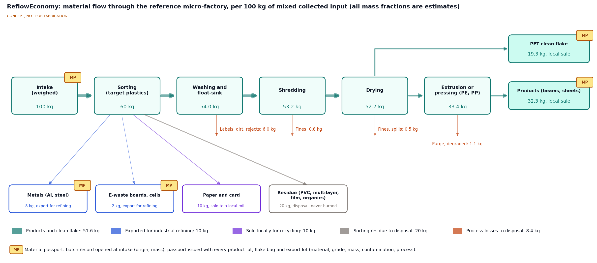
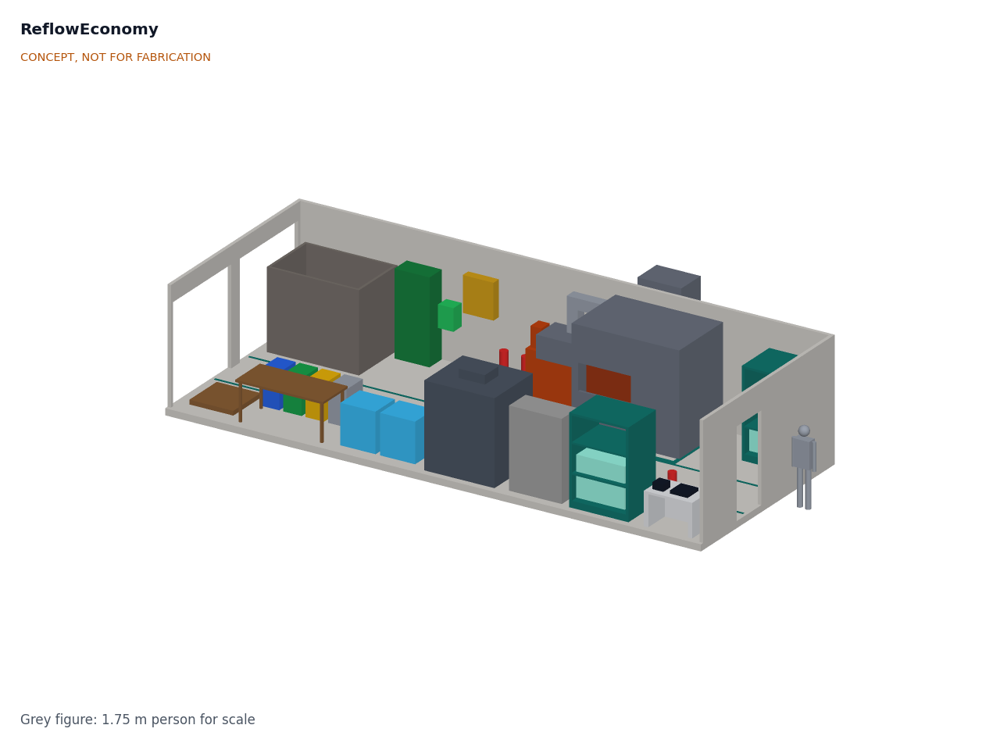
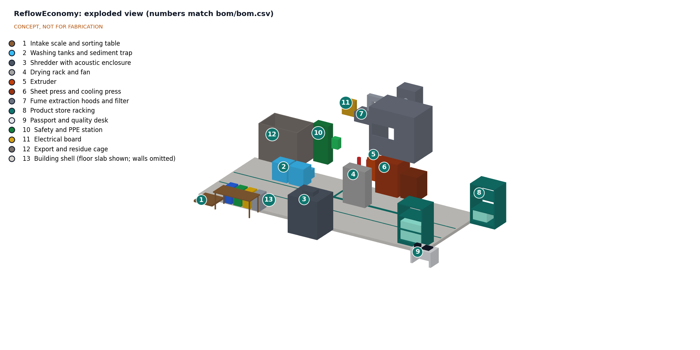

# ReflowEconomy design precis

ReflowEconomy is an open playbook for local micro-factories, built around one reference design: a plastics micro-factory on 59.4 m² (two 40 ft container footprints) that takes in 100 kg of collected material per shift, sorts out metals, e-waste and residue, and turns HDPE and PP into sheets and beams while selling PET as clean flake. The calculation note RFE-CAL-001 shows, on paper, that 51.6 % of input mass is kept local as products and clean flake, 10 % is exported for industrial refining, 10 % is sold to a local mill and 28.4 % goes to licensed disposal, using 0.83 kWh per kilogram of output with a maximum demand of 8.35 kW on a single-phase supply. The equipment costs $24,050 (indicative, excluding the building). The site only breaks even at the assumed prices (about +$1.73 per shift before rent), so the product price, not the machinery, decides whether a site pays its way. A material passport opens at intake and travels with every lot that leaves.



*Figure 1. Material flow through the reference micro-factory per 100 kg of mixed collected input, from RFE-CAL-001. MP marks where a material passport record is opened (intake) and issued (every lot that leaves). All mass fractions are estimates.*



*Figure 2. The reference micro-factory from the parametric model (`cad/src/model.py`) with the front wall left out and a 1.75 m person for scale. Material moves left to right from the intake door along a central aisle; the hot zone sits in the back row under two enclosing hoods.*

## What the playbook contains

| Part | File | State at TRL 3 |
| --- | --- | --- |
| Material feasibility matrix | `docs/playbook/feasibility-matrix.md` | Draft, 7 material groups; hazard, export point and source columns still to add (R1) |
| Safety and environmental rules | `docs/playbook/safety.md` | Ten rules; expanded in the safety section below |
| Process recipes | `docs/playbook/recipes/` | PET flake, HDPE, PP and aluminium (add-on bay), each sourced (R2) |
| Economics model | `docs/playbook/economics_model.py` with `economics_inputs.csv` | Operator-editable, per kilogram and per shift, with break-even points (R3) |
| Reference micro-factory | This precis, `cad/src/model.py`, RFE-DWG-001, `bom/bom.csv`, RFE-CAL-001 | Parametric layout, floor plan GA, priced equipment list and sizing |
| Material passport | `standards/material-passport-v0.2.schema.json`, `standards/examples/` | Schema v0.2 with example records; v0.1 kept |

Machines live in their own repos: [wastewise-scan](https://github.com/BoujeeEnjinia1701/wastewise-scan) identifies plastic resin at intake, [WasteWise-ml](https://github.com/BoujeeEnjinia1701/WasteWise-ml) classifies material class and grade from a phone photo, and a shredder, an aluminium micro-foundry and a cell tester are planned.

## How it works

1. **Intake.** Pickers and collectors deliver bags at the intake door. Each delivery is weighed on the platform scale and gets a batch record: batch ID, origin (collection point), mass and date. This opens the material passport. The picker is paid by weight and grade.
2. **Sorting.** At the sorting table, material is split by hand, helped by WasteWise-ml on a phone or a WasteWise Scan NIR reader for unclear plastics. Target plastics go to color-coded bins (PET, HDPE, PP). Aluminium and steel go to a metals bin, paper and card to bags, and circuit boards and cells to the export cage. PVC, multilayer packaging, film, polystyrene and organics go to residue. Lithium cells are pulled out first and stored in a fire-safe container.
3. **Washing.** Whole bottles and rigid parts are soaked, scrubbed and rinsed in the first tank, and labels are stripped.
4. **Shredding.** A guarded 2.2 kW shredder in a lined acoustic enclosure cuts clean parts into flake of about 5 to 10 mm, one polymer at a time.
5. **Float-sink and drying.** In the second tank, PP and HDPE flake floats and PET sinks, which removes cross-contamination. Flake dries on mesh trays with a fan. PET flake is bagged and sold as clean feedstock.
6. **Extrusion and pressing.** HDPE and PP flake dried on the previous shift becomes beams in the extruder (in the morning, while the shredder runs) and 1 x 1 m sheets in the sheet press (in the afternoon). A heater interlock keeps the press heaters off while the shredder or extruder runs, so the line works on a 40 A single-phase supply. Trim goes back to the shredder.
7. **Product store and passport.** Every product lot, flake bag and export lot gets a passport at the desk (schema v0.2: material, grade, mass, contamination, process, parent batch IDs and a recycled content statement) and a printed label, then goes to the racking or the export cage.

The steps are written out per material in the process recipes (`docs/playbook/recipes/`). Numbers match the exploded view (Figure 3), the floor plan RFE-DWG-001 and `bom/bom.csv`.

| # | Zone or item | Choice | Notes |
| --- | --- | --- | --- |
| 1 | Intake scale and sorting table | 300 kg platform scale, 2.0 x 0.9 m steel table, four color-coded bins (PET, HDPE, PP, metals) | Opens the batch record |
| 2 | Washing tanks and sediment trap | Two 400 to 500 L polyethylene tanks (pre-wash, float-sink), 0.75 kW pump, settling trap | Wash water reused; sludge to licensed disposal |
| 3 | Shredder with acoustic enclosure | Open-design shredder (Precious Plastic Shredder Pro class), 2.2 kW gearmotor on a single-phase input drive, interlocked feed chute, lined enclosure | 15 kg/h assumed; about 15 dB insertion loss assumed |
| 4 | Drying rack and fan | Ten mesh trays (7.2 m²), 0.4 kW fan | 7.3 kg/m² at the reference input |
| 5 | Extruder | Open-design extruder, 1.5 kW motor and 2.0 kW heaters, with barrel enclosure (hood B) | HDPE and PP only; 5 kg/h assumed |
| 6 | Sheet press and cooling press | 1 x 1 m press with 5 kW single-phase heaters and a cooling press, in booth hood A | A derated variant of the published 15 kW, 400 V sheetpress |
| 7 | Fume extraction hoods and filter | Booth A (1.2 x 0.6 m sash) and hood B (0.8 x 0.4 m), 250 mm duct, 1.1 kW fan outside, G4, F7 and impregnated carbon filters, stack above the roof | 0.57 m³/s at about 815 Pa (RFE-CAL-001) |
| 8 | Product store racking | Two bays: products in the back row, PET flake bags in the front row | Bay 1 is 1.0 m from the hot zone |
| 9 | Passport and quality desk | Desk, label printer, 30 kg bench scale, moisture meter, phone or laptop | Issues passports |
| 10 | Safety and PPE station | PPE cabinet, eyewash, first aid, three fire extinguishers | Entrance, hot zone and product end |
| 11 | Electrical board | 230 V 40 A single-phase board, 30 mA RCDs, emergency stop circuit, heater interlock, energy meter | Installed by a licensed electrician |
| 12 | Export and residue cage | Lockable mesh cage by the export door, fire-safe cell container, bales and bags | Holds lots awaiting collection |
| 13 | Building shell | Two 40 ft containers side by side (12.19 x 4.88 m) with the adjoining walls removed, or a rented shed of about 60 m² | Site-dependent; excluded from the equipment total |



*Figure 3. Exploded view of the reference layout with numbered zones matching `bom/bom.csv`. The walls are omitted so nothing is hidden.*

## Layout

The floor plan general arrangement is RFE-DWG-001 Rev P1 (`cad/drawings/RFE-DWG-001.pdf`), generated from `cad/src/model.py`. A central aisle runs along the container seam, 1.20 m painted and 1.52 m clear between equipment. The front row holds intake, washing, the enclosed shredder, drying, the flake racking and the passport desk; the back row holds the export cage by the export door, the safety station, the electrical board, the hot zone and the product racking. Doors are at the intake end (intake and export) and a personnel exit is at the far end.

## Numbers from RFE-CAL-001

All values are estimates on paper. The calculation note gives the assumptions and the script `docs/04-calcs/sizing.py` prints every figure.

*Table 1. Key results per shift of 100 kg input.*

| Quantity | Value | Requirement |
| --- | --- | --- |
| HDPE and PP products; PET clean flake | 32.3 kg; 19.3 kg (51.6 % kept local) | R7 met |
| Metals and e-waste exported for refining | 10.0 kg | R4 not met (per-stream rules to write) |
| Paper and card sold to a local mill | 10.0 kg | |
| To licensed disposal | 28.4 kg (20.0 kg sorting residue, 8.4 kg process losses) | **R8 not met** |
| Energy | 42.9 kWh, 0.83 kWh/kg of output | R9 met |
| Maximum electrical demand | 8.35 kW, 36 A at 230 V with the heater interlock (13.35 kW connected) | Decision item 5 |
| Shredder time | 3.79 h of 4 h at an assumed 15 kg/h | R6 at risk |
| Sheet press | 2.06 sheets of capacity for 2 in the afternoon | R6 at risk |
| Fume extraction | 0.57 m³/s, 815 Pa, fan 1.00 kW | R11 hoods sized; exposure not verifiable at TRL 3 |
| Shredder noise at the operator | 94 dB(A) bare, 79 dB(A) enclosed (LEX,8h, assumed sound power) | R12 at risk |
| Equipment, items 1 to 12 | $24,050 indicative | R10 met |
| Result per shift before rent | +$1.73; break-even product price $2.45/kg; break-even input 98 kg | R3 met (model delivered) |

The TRL 2 figures in v0.2 of this precis (30 kg products, 20 kg flake, about 45 kWh, about 13 kW peak, $22,850, margin about $18) are replaced by Table 1.

## Economics

The operator-editable model (`docs/playbook/economics_model.py`, inputs in `docs/playbook/economics_inputs.csv`) gives an operating margin of about $21 per shift and a result of about +$1.73 after recovering the equipment over five years, before rent. Each $0.50/kg on the product price moves the result by about $16 per shift, so product design and local buyers matter more than machine cost. Prices and wages vary widely by country and must come from the co-design partner.

## Material passport

The passport is a JSON record, one per lot, validated against `standards/material-passport-v0.2.schema.json`. It opens at intake as a batch record and is issued with every lot that leaves (Figure 1). Schema v0.2 adds `schema_version`, `product_form`, `parent_batch_ids` and a recycled content statement aligned with ISO 14021 (decided by Amish, 2026-09-25, RFE-DDR-001 item 4). Schema v0.1 (`standards/material-passport.schema.json`) is kept unchanged. Example records are in `standards/examples/`; this one uses invented values:

```json
{"schema_version": "0.2", "batch_id": "RFE-DEMO-S-0001", "product_form": "sheet",
 "parent_batch_ids": ["RFE-DEMO-I-0001", "RFE-DEMO-I-0002"], "material": "HDPE",
 "mass_kg": 11.2, "origin": {"country": "XX", "collection_point": "Market cooperative A; school collection point B"},
 "identification": {"method": "wastewise-ml", "confidence": 0.93}, "contamination_pct": 1.5,
 "processed_by": "Demo micro-factory", "process": "wash, shred, float-sink, dry, sheet-press",
 "recycled_content": {"post_consumer_pct": 100, "pre_consumer_pct": 0, "basis": "mass", "standard": "ISO 14021",
   "statement": "Contains 100 % post-consumer recycled HDPE by mass (self-declared, ISO 14021)."},
 "date": "2026-09-25"}
```

## Key design choices (decided by Amish, 2026-09-25, RFE-DDR-001)

- **Plastics line as the reference micro-factory.** Plastics have the most open machine designs and the lowest entry cost. Aluminium remelting, rated high in the feasibility matrix, is a separate add-on bay with its own safety case, not part of the reference floor.
- **Two 40 ft container footprints.** A single 40 ft container is about 2.35 m wide inside, too narrow for safe aisles around a sheet press. Two side by side (or a shed of the same area) give 59.4 m².
- **PET sold as flake; HDPE and PP made into products.** This keeps the hot zone to the two polymers that small extruders and presses handle well.
- **Single-phase supply with staggered heating.** A heater interlock keeps the maximum demand at 8.35 kW, so the playbook works on weak grids.
- **Passport schema v0.2.** Parent batch IDs, schema version, product form and a recycled content statement, issued as a new file beside v0.1.

Two layout choices follow from these and are not separate decisions: one hot zone under two enclosing hoods, away from the intake and the product store; and passports issued at the desk, not at each machine.

## Safety

> **Safety:** A micro-factory combines moving machinery, hot surfaces, fumes, water near electricity, sharp and contaminated input and a high fire load of plastic. These rules extend `docs/playbook/safety.md` and must be reviewed by a qualified safety professional before any site operates.

- **Shredder (moving machinery).** Fixed guards, a hopper interlock that stops the rotor when opened, an emergency stop within reach, lockout before clearing jams, and no hands or tools in the hopper. In the reverberant steel room a bare shredder would put the whole floor at about 95 dB(A), so the shredder sits in a lined acoustic enclosure with an interlocked feed chute and door (about 79 dB(A) over 8 h on paper, RFE-CAL-001 section 7). The shredder area stays a hearing protection zone until the level is measured.
- **Heat.** Extruder barrels and press platens run at about 190 to 200 °C (never above 230 °C for HDPE or 240 °C for PP). Insulated covers, heat-resistant gloves, face shields and a cool-down rule before maintenance. Never leave heaters on unattended.
- **Fumes.** Only identified HDPE and PP are melted. PVC is never heated (it releases hydrogen chloride), and polystyrene, PET and unknown plastics are not melted in the reference line. Extraction runs whenever a heater is on and for 30 min after, through two enclosing hoods sized for 0.5 m/s at their openings (RFE-CAL-001 section 6).
- **Electricity and water.** 30 mA RCDs on every circuit, splash-rated sockets near the wash tanks, a heater interlock that keeps the maximum demand at about 36 A on a 40 A single-phase supply, and an installation by a licensed electrician.
- **Input hazards.** Needles, broken glass, cans and chemical containers arrive mixed in. Puncture-resistant gloves, a sharps container, and a rule that medical, chemical and hazardous waste is refused at the door.
- **Lithium cells.** Pulled out first at intake, never punctured or crushed, terminals taped and stored in a fire-safe container with dry sand. A cell in the shredder can start a fire.
- **Fire.** Plastic stock and flake are a high fire load. Three extinguishers (entrance, hot zone, product end), stock kept at least 1.0 m from the hot zone, clear exits, no smoking and a daily cleanup of dust and flake. Fine plastic dust can be combustible.
- **Wastewater and sludge.** Settled and disposed of through a licensed route, never discharged to drains or open ground.
- **People.** No workers under 18. PPE is supplied free. Manual handling limited to bags of 25 kg or less.
- **Structure.** Removing the adjoining side walls of two containers weakens them. A structural engineer must specify the reinforcement, or a shed of the same size is used.
- **Molten metal.** No aluminium is melted on the reference floor. The add-on bay needs its own safety case first (RFE-DDR-001 item 1; `docs/playbook/recipes/aluminium.md`).

## Open questions

- [ ] Real target-plastic share and contamination of collected input in the first partner region (drives R7 and R8)
- [ ] Measured shredder, extruder and sheet press rates, and whether a 5 kW single-phase press can be built to hold a 55 min cycle (R6; RFE-DDR-001 item 9)
- [ ] Measured shredder sound power and enclosure insertion loss (R12)
- [ ] Air monitoring at the hot zone on a running site (R11)
- [ ] Local prices for products, flake, metals and paper, and local wages (economics model inputs)
- [ ] Passport fields that buyers actually need, and a form fast enough for R15
- [ ] Permits for a small plastics recycler in the first target region
- [ ] How R8 counts process losses (RFE-DDR-001 item 8), fan size (item 10) and container structure (item 11), awaiting Amish
