# ReflowEconomy prototype build plan

**Plan, not yet built.** How to fit out the first reference micro-factory, component by component. Building and running it is TRL 4 work. Decisions still to be made are kept in the design decisions register ([docs/06-design-decisions.md](06-design-decisions.md)), not here.

## 1. What you are building

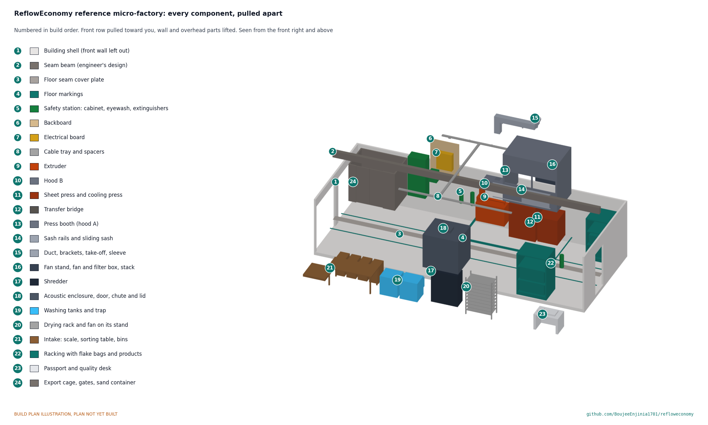

*Figure 1. Every component pulled apart and numbered in build order. The front row is pulled toward you; wall-mounted and overhead parts are lifted.*

The prototype is the reference micro-factory itself: a plastics line on a 12.19 x 4.88 m floor, drawn here in two 40 ft shipping containers joined side by side, which is the harder case (in a rented shed of the same size, skip everything about the seam). Material comes in at the intake doors, is weighed and sorted, washed, shredded inside a lined enclosure and dried along the front row, then pressed into sheets or extruded into beams in the hot zone in the back row, under two enclosing hoods that a fan outside the back wall extracts. Figure 1 shows the 24 components in the order you fit them. Eleven are made in a local workshop from steel angle and tube, galvanised sheet, welded mesh, aluminium tread plate and plywood: the floor seam plate, the backboard, hood B, the transfer bridge, the press booth, the sliding sash and its rails, two duct brackets, the fan stand, the shredder enclosure, the drying rack with its fan stand, and the export cage. The three machines (shredder, extruder and sheet press) are built by a fabricator to their published open designs or bought; everything else is bought and fitted. The work is cutting, drilling, welding and bolting steel, riveting sheet, screwing to a container floor and wall, and licensed electrical work. Value-engineering target for the equipment: USD 25,000. Estimated cost of the constructable design: USD 25,300 (USD 300 over the target), plus about USD 9,200 for the container shell.

> **Safety:** This is a workshop with a shredder, surfaces at 190 to 200 °C, melt fumes, water near electricity, a 230 V 40 A supply, lithium cells hidden in collected waste and a high fire load. The container walls are cut only after a structural engineer's beam is in. Only a licensed electrician connects the supply. Nothing is shredded, heated or melted until the safety stops in section 6 are passed, and a qualified safety professional reviews the finished layout before anyone works in it.

## 2. What changed to make it buildable

The concept layout showed where everything goes; some of its parts overlapped, hung in the air or could not be reached. Each change below keeps what the micro-factory does, and all of them are recorded in decision record RFE-DDR-003, open for Amish's review.

*Table 1. Changes from the concept.*

| Component | The concept had | The buildable design has | Why |
| --- | --- | --- | --- |
| Container seam | Side walls removed, nothing along the seam | A seam beam under the roof on the corner posts (engineer's design) and a floor seam plate (Figures 2 and 4) | The roof needs carrying once the walls go; the floor joint is in the aisle |
| Hood B | A hood hanging in the air, cutting into the extruder | A sheet box bolted to the extruder frame, the barrel through its end (Figure 13) | The frame is the only thing there to carry it |
| Duct | Through the booth wall and roof, with no inlet in the booth | Under the booth roof, through a sealed collar, with a booth take-off and damper (Figures 18 and 22) | The booth is now actually extracted |
| Press booth | One opening, the cooling press unreachable | Two openings, one sliding sash, a transfer bridge between the presses (Figures 15, 17 and 20) | The hot mould stays in the booth; only one opening is ever open |
| Shredder enclosure | A floor the shredder stood in; chute mouth 2.1 m up; door blocked by the tanks | No floor; roof 1.60 m; chute mouth 1.70 m with a lid; door on the aisle face (Figures 26 to 28) | It can be built round the machine, fed from the floor and opened |
| Board and eyewash | On the bare corrugated wall | On a plywood backboard (Figure 7) | Something flat to screw to |
| Cables | No route | One cable tray, crossing the aisle under the seam beam (Figure 9) | One crossing, with the least loss of headroom |
| Fan box | Floating outside the wall | On a braced stand, with the stack drawn (Figure 25) | It needs a support that does not load the wall |
| Drying fan | Floating | On a floor stand (Figure 31) | |
| Export cage | No gate that could open | A double gate on the aisle face (Figure 33) | The export doors are only 170 mm away |
| Bins | Over the painted aisle line | Behind it; the clear aisle widens to 1.57 m | Keeps the aisle clear |

## 3. Making the components

Make and check each component before the assembly step that needs it. Sizes are in millimetres. Positions along the line are measured from the outside face of the intake end wall, and positions across from the outside face of the front wall (the long wall on the intake row side); both walls are taken as 80 thick, so their inside faces are at 80. "Back" is the long wall with the hot zone. Workshop tolerance is 2 mm unless a step says otherwise; drawings do not carry tolerances before TRL 4.

### 3.1 Building shell and seam beam (container option)

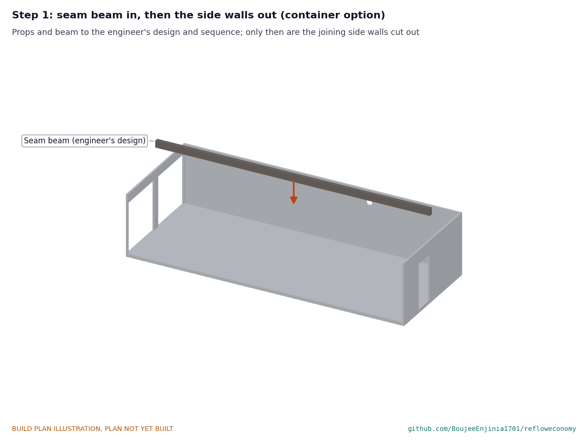

*Figure 2. The seam beam goes in under the roof before the joining side walls are cut out.*

**What it is.** Two used 40 ft containers placed side by side on level footings, doors at the intake end, with the two side walls that touch removed so the floor is one room. A personnel exit door is cut in the far end wall of the intake-side container, 1,300 to 2,200 from the front wall and 2,000 high. A 250 mm hole for the fume duct goes through the back wall, centred 8,150 along and 2,050 up.

**How it is made.** By the container dealer or a fabricator, to a structural engineer's design and sequence: prop the roofs, fit the seam beam under the roof along the seam on the corner posts at both ends, then cut the side walls out, then seal the roof joint with flashing. The design reserves a space 165 wide and 305 deep under the roof along the seam for the beam; its section and fixings are the engineer's. In a rented shed none of this is needed.

**Check before moving on.** The engineer has signed off the beam and the propping has been removed on their say-so; the roof joint is watertight in rain.

### 3.2 Floor seam cover plate (make 4)

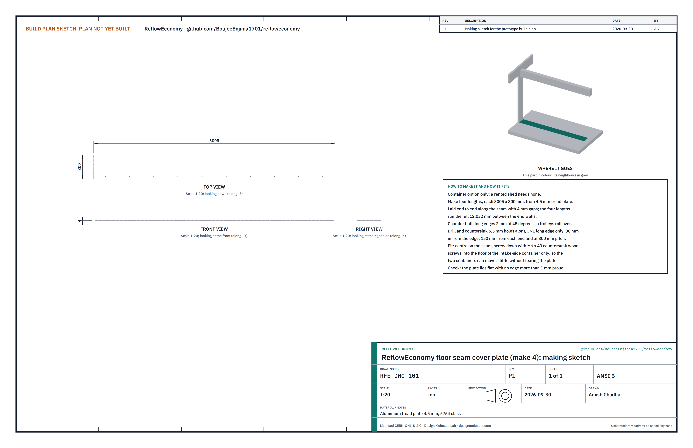

*Figure 3. Floor seam cover plate making sketch (RFE-DWG-101).*

**What it is and what it is made from.** A strip of tread plate that covers the joint between the two container floors down the middle of the aisle. Aluminium tread plate 4.5 mm thick, 5754 class, in four lengths of 3,005 x 300.

**How to make it.**

1. Cut four lengths 3,005 x 300 and square the ends.
2. Chamfer both long edges 2 mm at 45° so trolley wheels roll over them.
3. Along one long edge only, 30 from the edge, drill and countersink 6.5 mm holes: the first 150 from one end, then every 300 (ten holes per length).
4. Deburr every edge and hole.

**How it fits the parts next to it.**

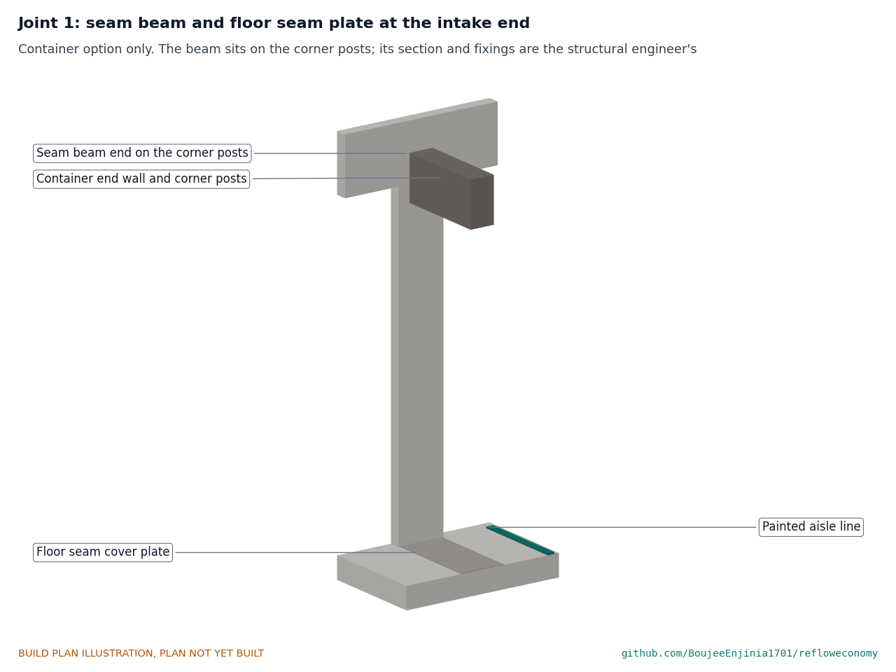

*Figure 4. The plate is centred on the seam; the beam above it sits on the corner posts.*

The four lengths lie end to end along the seam with 4 mm gaps, together running the 12,032 between the end walls. The drilled edge goes over the intake-side container and is screwed into its floor with M6 x 40 countersunk wood screws; the other edge rests on the other container's floor, unfixed, so the two containers can move a little without tearing the plate.

**Check before moving on.** No edge stands more than 1 mm proud of the floor.

### 3.3 Floor markings

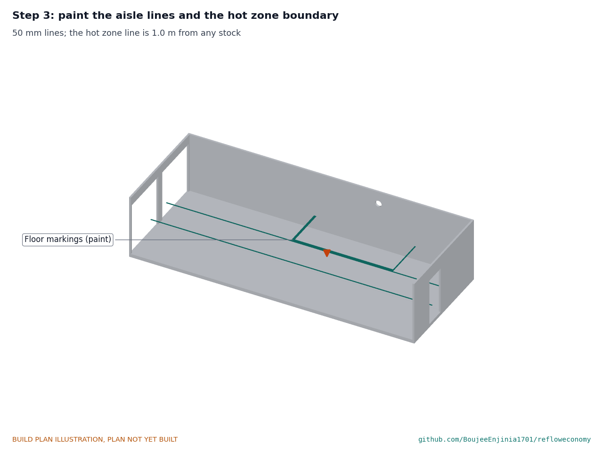

*Figure 5. The painted aisle edges and the hot zone boundary.*

Two 50 mm lines mark the aisle edges, 1,650 to 1,700 and 2,900 to 2,950 from the front wall, along the whole floor. The hot zone boundary runs from 5,400 to 9,750 along the line: a 100 mm band across the front of the hot zone, 2,960 to 3,060 from the front wall, and legs back to the back wall at each end (the far leg is 50 wide and runs along the outside of the press booth). Use a floor paint for plywood floors; nothing is stored inside the boundary, and stock stays at least 1.0 m outside it.

### 3.4 Safety station (bought)

A PPE and first aid cabinet 800 x 450 x 1,900 standing against the back wall at 2,500 to 3,300 along, held by two wall brackets; an eyewash fitted to the backboard (section 3.5); and three fire extinguishers on floor stands, two at the hot zone entrance (4,800 and 5,300 along, against the back wall) and one at the product end (10,600 along, beside the aisle). It goes in first, before any power or hot work (step 4).

### 3.5 Backboard

*Figure 6. Backboard making sketch (RFE-DWG-102).*

**What it is and what it is made from.** A flat board on the corrugated back wall that the electrical board and the eyewash screw to. One sheet of 18 mm fire-retardant plywood, cut to 1,300 x 1,550.

**How to make it.**

1. Cut the sheet to 1,300 wide x 1,550 tall and seal both faces and every edge with two coats of paint.
2. Drill six 9 mm holes: 100, 650 and 1,200 from the left edge, in two rows 100 and 1,450 up from the bottom edge.
3. Hold it on the wall and move any hole sideways by up to 40 so it lands on a corrugation crest; fit an M8 rivet nut in the wall behind each hole.

**How it fits the parts next to it.**

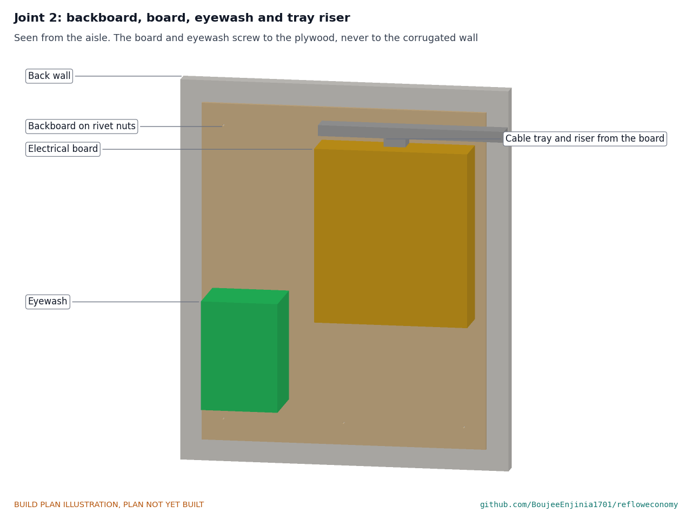

*Figure 7. The board and the eyewash screw to the plywood, never to the corrugated wall.*

The backboard sits on the back wall from 3,350 to 4,650 along and from 600 to 2,150 above the floor, held by six M8 x 30 screws with large washers into the rivet nuts. The electrical board covers 550 to 1,250 from the board's left edge and 600 to 1,400 up from its bottom edge; the eyewash covers 50 to 400 across and 200 to 700 up. The cable tray runs across the front of the board's top, 1,438 up.

**Check before moving on.** The board does not rock on the corrugations; every screw is tight.

### 3.6 Electrical board and cable tray (licensed electrician)

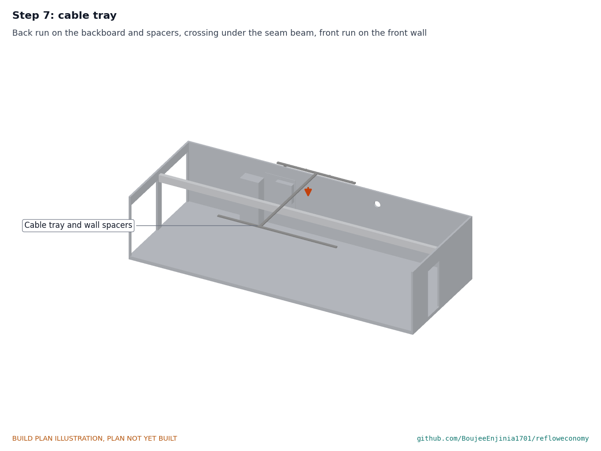

*Figure 8. The tray runs along the back wall, crosses the aisle once under the seam beam and runs along the front wall.*

**What to buy and fit.** A distribution board for a 230 V, 40 A single-phase supply with 30 mA residual current devices on every circuit, circuit breakers, an emergency stop circuit, the heater interlock contactor that locks the press heaters out while the shredder or extruder runs, and an energy meter. About 20 m of 100 x 50 perforated galvanised cable tray with three wall spacers, two beam clamps and a short riser trunking from the board top.

**How it fits.** The tray's underside is 2,038 above the floor everywhere. The back run sits on the backboard and on 20 mm spacers riveted to the wall at about 5,100, 6,100 and 7,050 along, from 3,900 to the end wall of the press booth, where the cables pass through a gland. The crossing runs across the aisle at 5,550 to 5,650 along, clamped under the seam beam. The front run is screwed to the front wall from 3,800 to 8,900 along, over the washing tanks, the shredder enclosure and the drying rack.

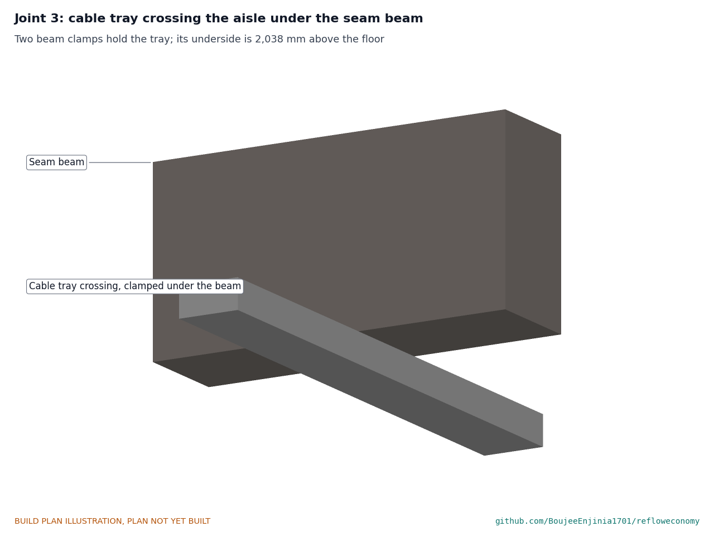

*Figure 9. Two beam clamps carry the crossing; it leaves 2.04 m of headroom over the aisle.*

**Check before moving on.** The electrician's installation certificate and residual current device trip tests are done (stop S3).

### 3.7 Extruder (built to its published design)

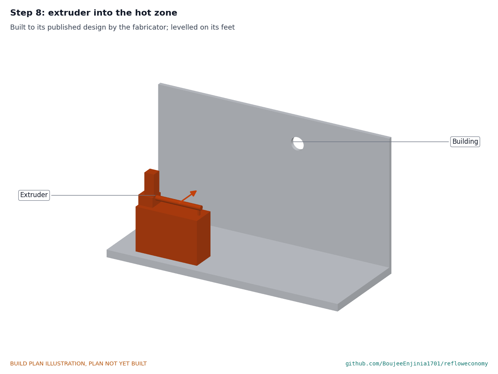

*Figure 10. The extruder stands in the hot zone against the back wall.*

**What to buy or have built.** An open-design extruder for beams and profiles, for HDPE and PP only, on a frame 1,300 long x 500 deep with a flat top 900 above the floor: a 1.5 kW motor on a single-phase input drive and 2.0 kW of barrel heaters, the hopper at the drive end. It stands at 5,700 to 7,000 along, 4,000 to 4,500 from the front wall, barrel along the line.

**Check before moving on.** The frame top is flat and level, with room for six M8 bolts round the barrel (section 3.8).

### 3.8 Hood B (extruder barrel enclosure)

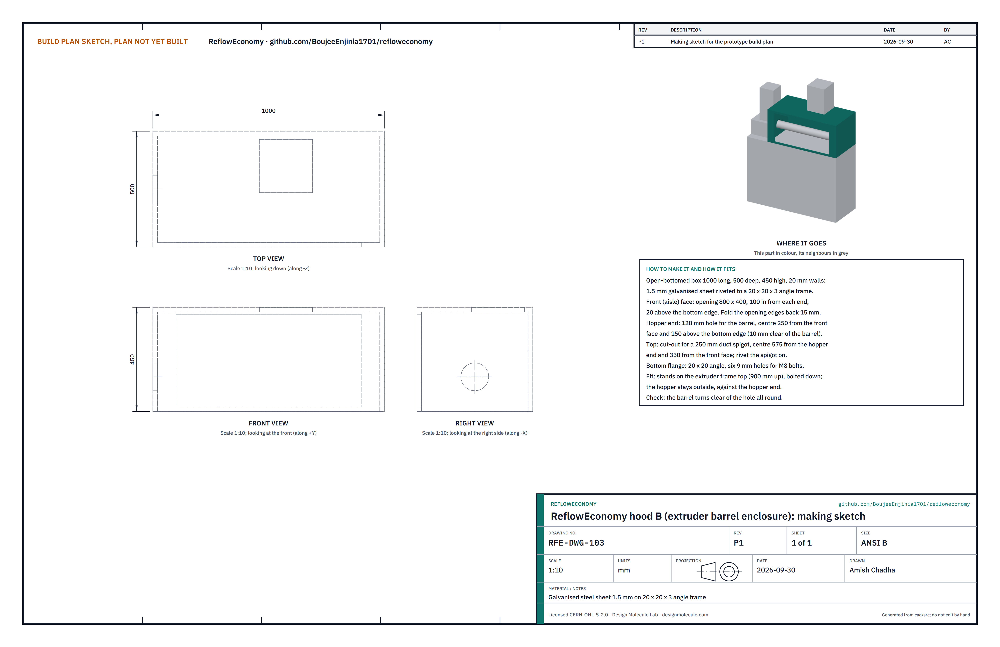

*Figure 11. Hood B making sketch (RFE-DWG-103).*

**What it is and what it is made from.** An open-bottomed sheet box over the hot barrel that the duct extracts. Galvanised steel sheet 1.5 mm riveted to a frame of 20 x 20 x 3 angle; the walls are drawn 20 thick.

**How to make it.**

1. Make the frame 1,000 long, 500 deep and 450 high from 20 x 20 x 3 angle, with a bottom flange of the same angle all round.
2. Front (aisle) face: cut an opening 800 wide x 400 tall, 100 in from each end and 20 up from the bottom edge; fold its edges back 15.
3. Hopper end: cut a 120 mm hole for the barrel, centred 250 from the front face and 150 up from the bottom edge.
4. Top: cut the hole for a 250 mm round duct spigot, centred 575 from the hopper end and 350 from the front face; rivet the spigot on.
5. Rivet the sheet to the frame. Drill six 9 mm holes in the bottom flange to match holes drilled in the extruder frame top.

**How it fits the parts next to it.**

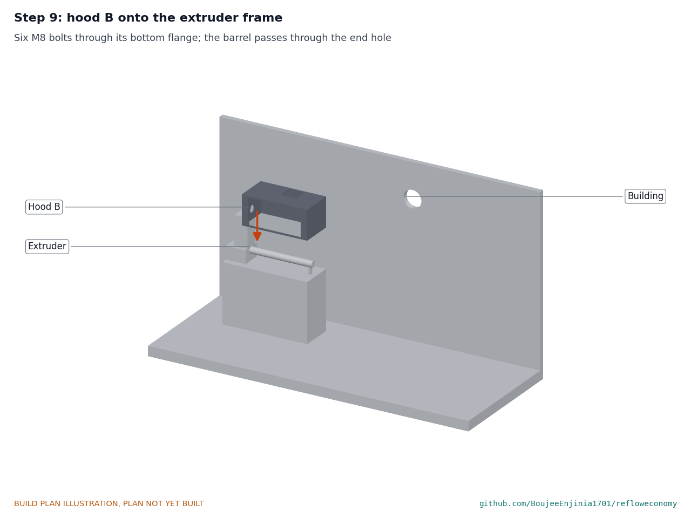

*Figure 12. Hood B goes over the barrel and down onto the frame.*

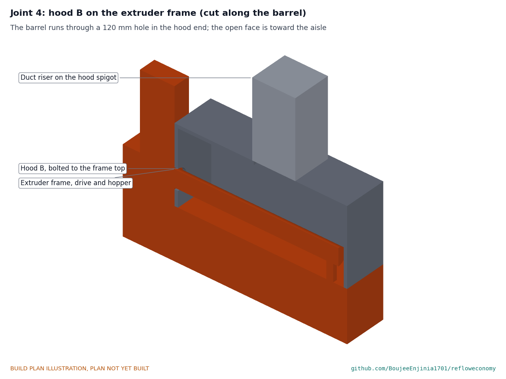

*Figure 13. Cut along the barrel: the hood stands on the frame top; the barrel runs through the end hole with 10 mm clear all round.*

The bottom flange sits on the extruder frame top, 900 above the floor, held by six M8 bolts. The hopper stays outside, against the hopper end. The duct riser stands on the top spigot.

**Check before moving on.** The barrel turns without touching the hole; the open face faces the aisle.

### 3.9 Sheet press and cooling press (built to their published designs)

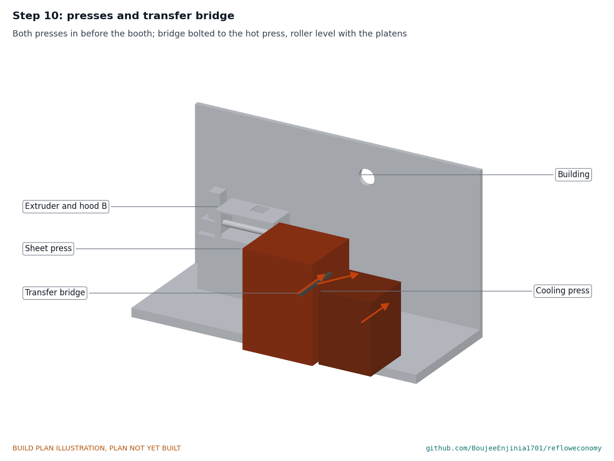

*Figure 14. Both presses go in before the booth is built round them.*

**What to buy or have built.** A 1 x 1 m heated sheet press with 5.0 kW single-phase heaters and insulated platens, on a frame about 1,200 x 1,100 (the derated single-phase variant of the published press), standing at 7,400 to 8,600 along, 3,500 to 4,600 from the front wall; and an unheated cooling press about 900 x 900, standing at 8,650 to 9,550 along, 3,600 to 4,500 from the front wall. Both platens are at the same working height, taken here as 950 above the floor.

### 3.10 Transfer bridge

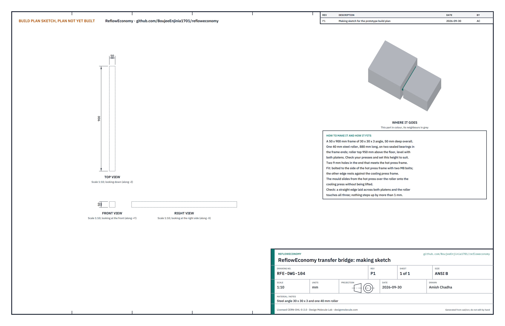

*Figure 15. Transfer bridge making sketch (RFE-DWG-104).*

**What it is and what it is made from.** A short roller bridge across the 50 mm gap between the presses, so the hot mould slides from the hot press onto the cooling press without being lifted. Steel angle 30 x 30 x 3 and one 40 mm steel roller on sealed bearings.

**How to make it.**

1. Weld a frame 50 wide x 900 long x 50 deep from 30 x 30 x 3 angle.
2. Fit one 40 mm roller, 880 long, on two sealed bearings in the frame ends, its top 950 above the floor (level with both platens; set this to suit the presses you have).
3. Drill two 9 mm holes in the side that meets the hot press frame.

**How it fits the parts next to it.**

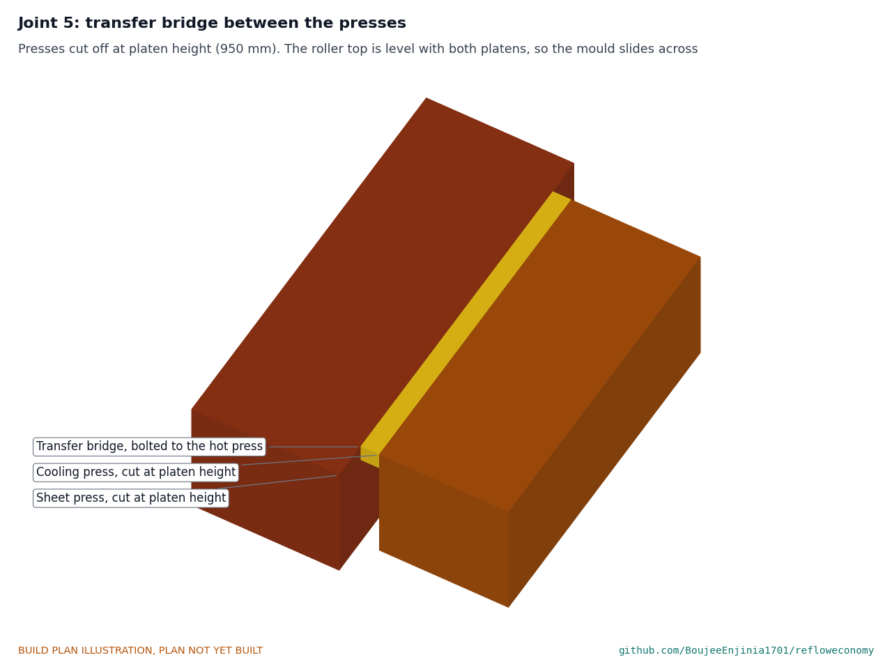

*Figure 16. Presses cut off at platen height: the roller top is level with both platens.*

One side bolts to the hot press frame with two M8 bolts; the other rests against the cooling press frame.

**Check before moving on.** A straight edge laid across both platens and the roller touches all three; nothing steps up by more than 1 mm.

### 3.11 Press booth (hood A)

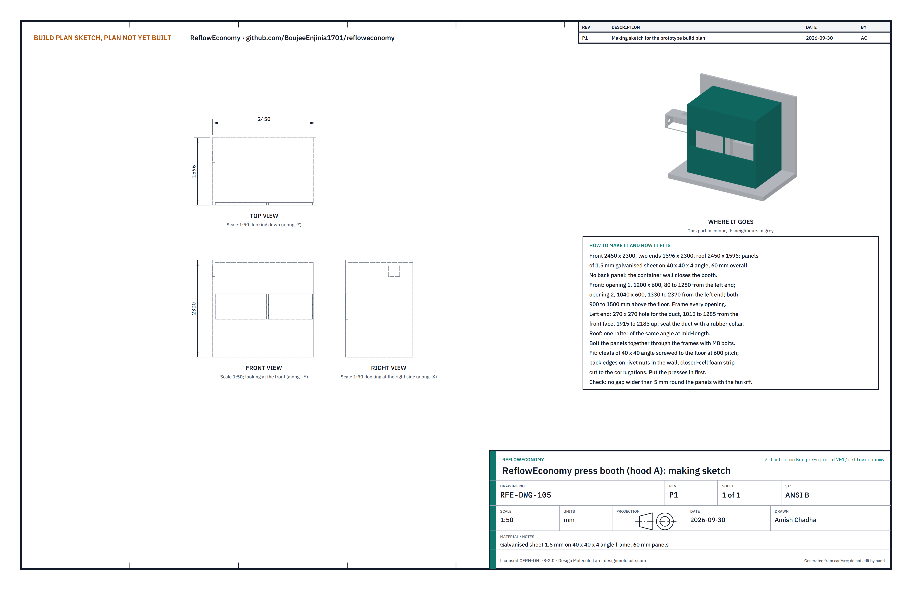

*Figure 17. Press booth making sketch (RFE-DWG-105).*

**What it is and what it is made from.** An enclosure round both presses, open at the back where the container wall closes it, extracted by the duct. Panels of 1.5 mm galvanised sheet on 40 x 40 x 4 angle frames, 60 overall.

**How to make it.**

1. Make a front panel 2,450 x 2,300, two end panels 1,596 x 2,300 and a roof 2,450 x 1,596, each a welded frame of 40 x 40 x 4 angle with sheet riveted to its outer face; give the roof one rafter of the same angle at mid-length.
2. Front panel: frame two openings, both 900 to 1,500 above the floor: opening 1, 1,200 wide, from 80 to 1,280 from the left end; opening 2, 1,040 wide, from 1,330 to 2,370.
3. Left end panel: cut and frame a 270 x 270 hole for the duct, 1,015 to 1,285 from the front face and 1,915 to 2,185 above the floor.
4. Drill the frames for M8 bolts at 400 pitch where the panels meet.

**How it fits the parts next to it.**

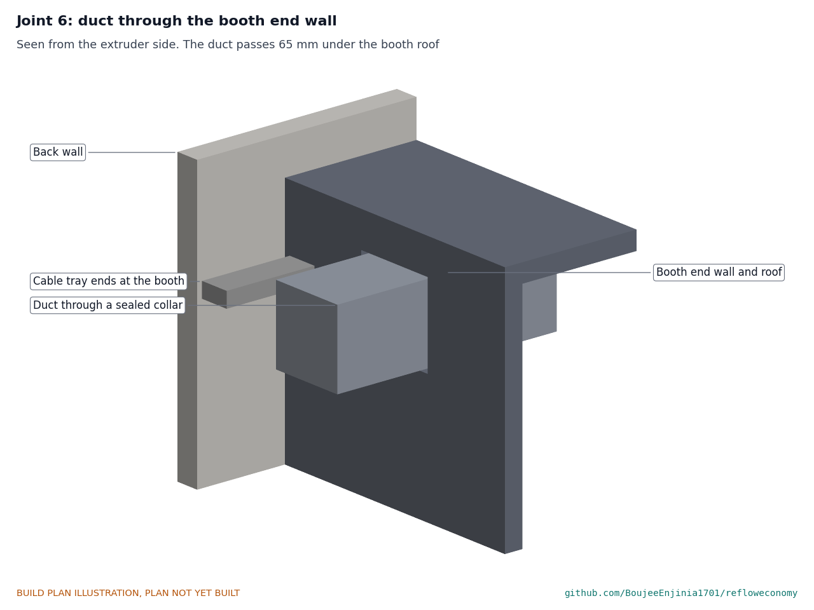

*Figure 18. Seen from the extruder side: the duct passes through a sealed collar in the end wall, 65 mm under the roof.*

The booth stands from 7,250 to 9,700 along and from 3,200 from the front wall back to the back wall, 2,300 high, round the two presses. The panels bolt together through their frames. The bottom frames are held to the floor by 40 x 40 angle cleats screwed down at 600 pitch; the back edges are screwed to rivet nuts in the wall, over a closed-cell foam strip cut to the corrugations. A rubber collar seals the duct in its hole.

**Check before moving on.** With the fan off, no gap round any panel is wider than 5 mm.

### 3.12 Sliding sash and rails

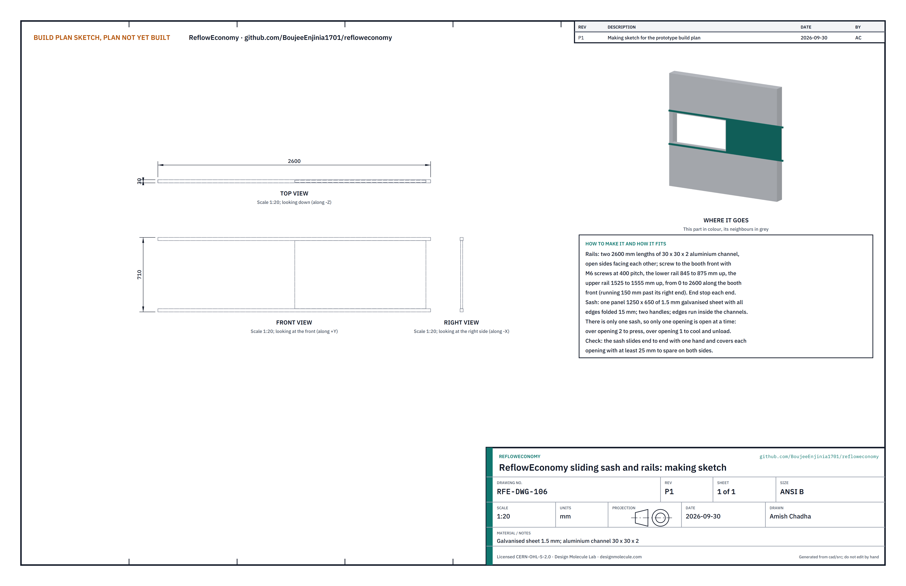

*Figure 19. Sliding sash and rails making sketch (RFE-DWG-106).*

**What it is and what it is made from.** One panel that slides along the booth front and always covers one of the two openings, so only one is ever open. Rails of 30 x 30 x 2 aluminium channel; the panel is 1.5 mm galvanised sheet.

**How to make it.**

1. Cut two rails 2,600 long. Drill 6.5 mm holes at 400 pitch through the channel back.
2. Cut the panel 1,250 x 650 with 15 mm folded edges on all sides, and fit two handles on its front.
3. Make two end stops from offcuts.

**How it fits the parts next to it.**

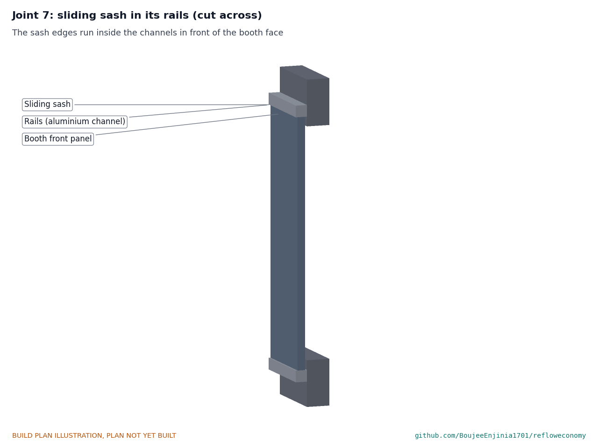

*Figure 20. Cut across: the sash's top and bottom edges run inside the channels in front of the booth face.*

The rails screw to the booth front with M6 screws, open sides facing each other: the lower one 845 to 875 above the floor, the upper one 1,525 to 1,555, both running from the booth's left end to 150 past its right end. The sash covers opening 2 while a sheet is pressed (opening 1 open) and opening 1 while the mould is moved to the cooling press and unloaded (opening 2 open).

**Check before moving on.** The sash slides end to end with one hand and covers each opening with at least 25 to spare on both sides.

### 3.13 Duct, booth take-off and duct wall brackets

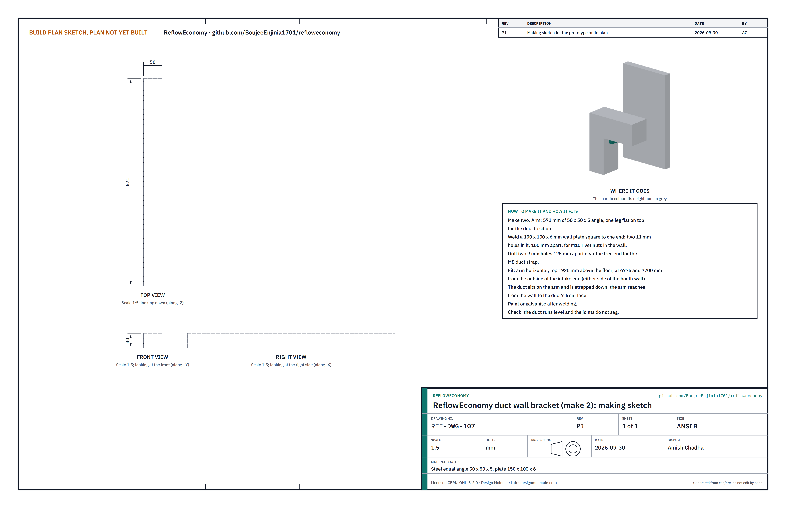

*Figure 21. Duct wall bracket making sketch (RFE-DWG-107).*

**What to buy.** 250 mm galvanised spiral duct and fittings: a riser from hood B, a straight run, a two-way elbow junction, a booth take-off with a balancing damper, and a flanged wall sleeve for the back wall hole.

**What to make: two wall brackets.** Each is a 571 long arm of 50 x 50 x 5 equal angle, one leg flat on top, with a 150 x 100 x 6 wall plate welded square to one end (two 11 mm holes 100 apart) and two 9 mm holes 125 apart near the free end for an M8 duct strap. Paint or galvanise after welding.

**How it fits the parts next to it.**

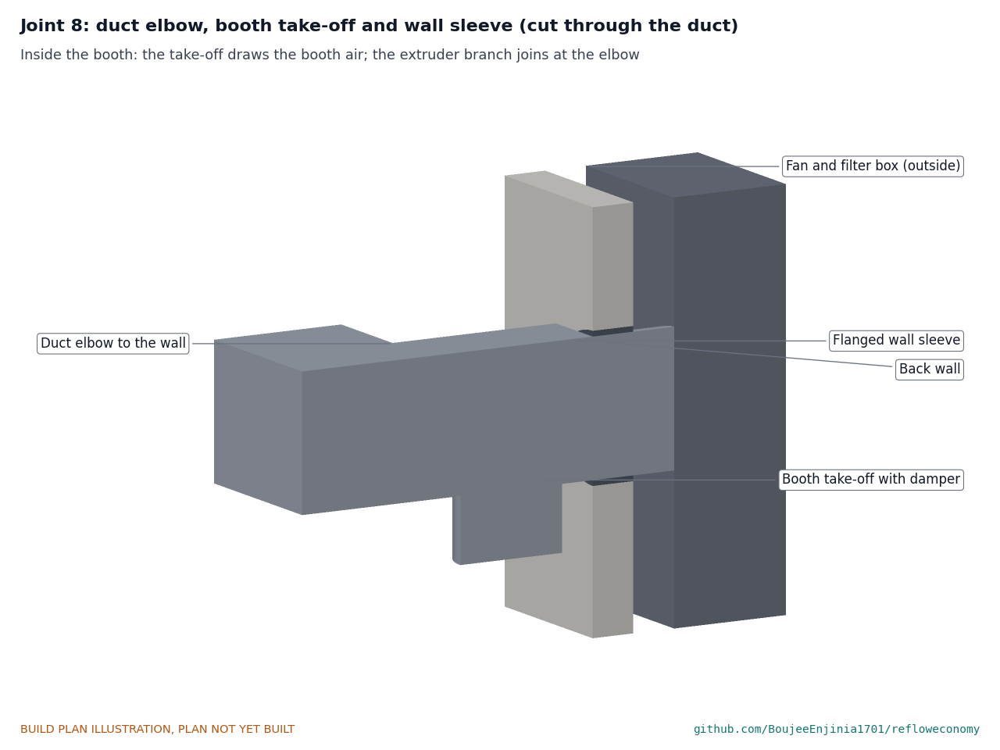

*Figure 22. Cut through the duct: inside the booth the take-off draws the booth air, and the hood B branch joins at the elbow.*

The riser stands on the hood B spigot and rises to a run centred 2,050 above the floor and 4,350 from the front wall. The run goes along the back row, through the booth end wall, to the elbow at 8,150 along, which turns it to the back wall and through the sleeve to the fan box. The booth take-off points down from the elbow. The brackets bolt to M10 rivet nuts in the back wall, arm tops 1,925 above the floor, at 6,775 and 7,700 along (one each side of the booth end wall); the duct sits on them and is strapped down.

**Check before moving on.** The run is level and every joint is sealed with duct tape over a sealant bead.

### 3.14 Fan stand, fan and filter box, and stack

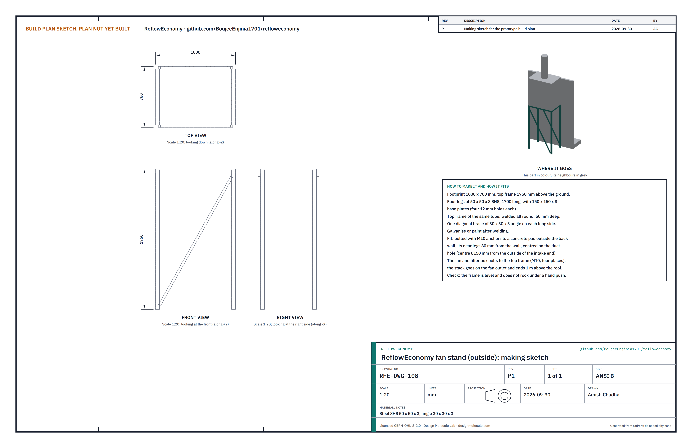

*Figure 23. Fan stand making sketch (RFE-DWG-108).*

**What it is and what it is made from.** A braced steel stand outside the back wall that carries the fan and filter box at duct height. Steel square hollow section 50 x 50 x 3 and angle 30 x 30 x 3.

**How to make it.**

1. Cut four legs of 50 x 50 x 3 tube, 1,700 long, and weld a 150 x 150 x 8 base plate to each with four 12 mm holes.
2. Weld a top frame of the same tube, 1,000 x 700 outside, onto the legs.
3. Weld one diagonal brace of 30 x 30 x 3 angle across each long side, from low on one leg to high on the other.
4. Drill four 11 mm holes in the top frame to match the fan box feet. Galvanise or paint.

**What to buy.** A 1.5 kW centrifugal fan in a box with a G4 prefilter, an F7 bag filter and an impregnated activated carbon stage, about 1,000 x 700 x 1,100; a 250 mm stack that ends 1 m above the roof, with a rain cap that does not deflect the plume downward.

**How it fits the parts next to it.**

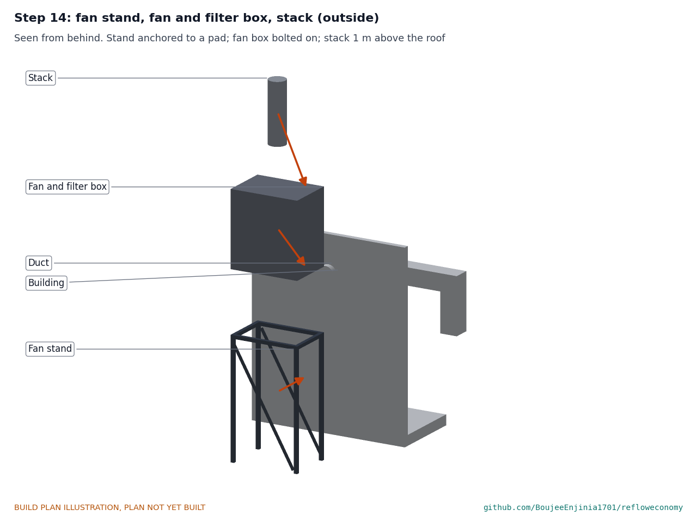

*Figure 24. Seen from behind the factory.*

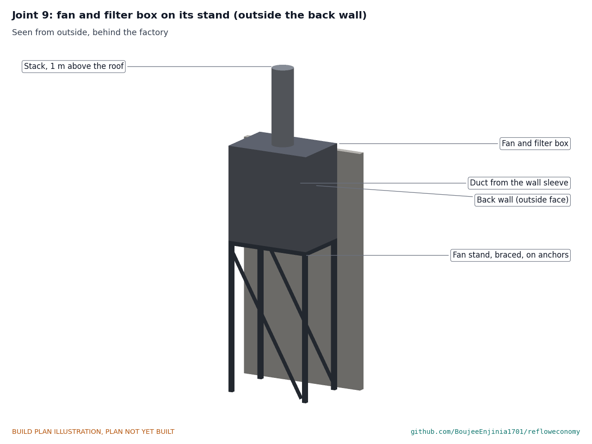

*Figure 25. The stand is bolted to a pad; the fan box bolts to its top frame; the stack goes on the outlet.*

The stand stands on a concrete pad (or four paving slabs on compacted ground) outside the back wall, its near legs 80 from the wall, centred on the duct hole, anchored with M10 anchors. The fan box bolts to the top frame with four M10 bolts; its inlet takes the duct from the wall sleeve at 2,050 above the inside floor.

**Check before moving on.** The frame is level and does not rock when pushed by hand at the top.

### 3.15 Shredder (built to its published design)

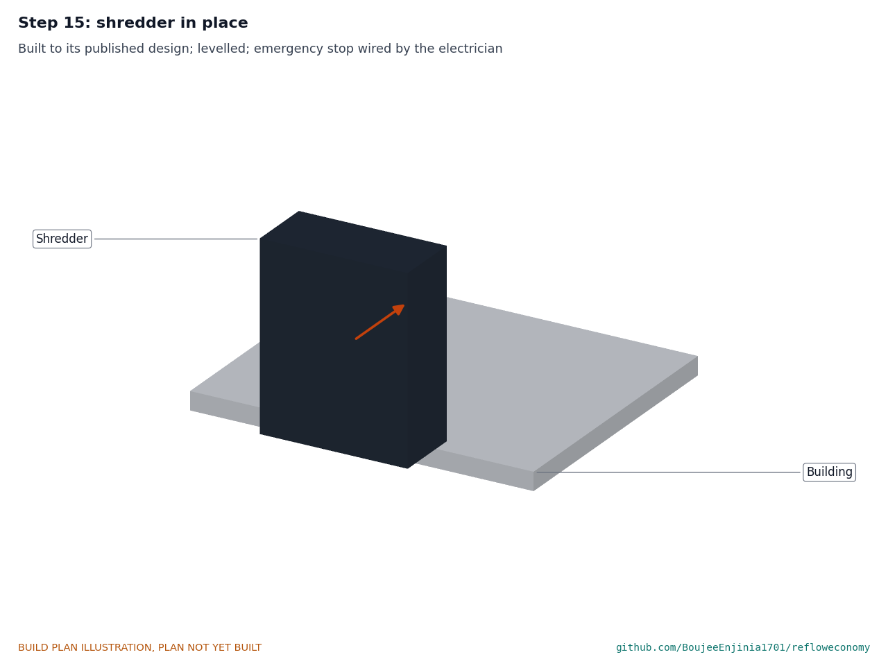

*Figure 26. The shredder stands in the front row before its enclosure is built round it.*

**What to buy or have built.** An open-design shredder of the Shredder Pro class, about 1,205 x 550 x 1,512 high including its hopper, with a 2.2 kW gearmotor on a single-phase input drive and an emergency stop. It stands at 6,000 to 7,205 along, 580 to 1,130 from the front wall, levelled on its feet.

### 3.16 Shredder acoustic enclosure, door and feed chute

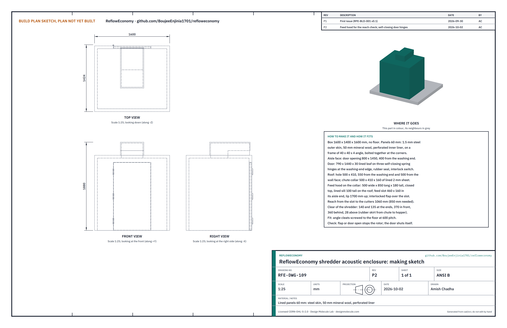

*Figure 27. Shredder acoustic enclosure making sketch (RFE-DWG-109).*

**What it is and what it is made from.** A lined box built round the shredder to cut its noise by about 15 dB, with an interlocked access door and an interlocked feed chute. Panels 60 thick: 1.5 mm steel outer skin, 50 mm mineral wool and a perforated inner liner, on frames of 40 x 40 x 4 angle.

**How to make it.**

1. Make four wall panels (two 1,600 long and two 1,400 long, all 1,540 tall) and a roof panel 1,600 x 1,400. There is no floor.
2. In the aisle-side panel, frame a door opening 800 wide x 1,450 tall, 400 from the washing end.
3. Make the door leaf 790 x 1,440 x 30 the same way, with three hinges, a rubber seal and an interlock switch.
4. In the roof, frame a hole 500 x 410, 550 from the washing end and 500 from the face nearest the front wall.
5. Make the chute collar: a 500 x 410 x 160 tube of lined 2 mm sheet, with a hinged lid and an interlock switch on the lid.

**How it fits the parts next to it.**

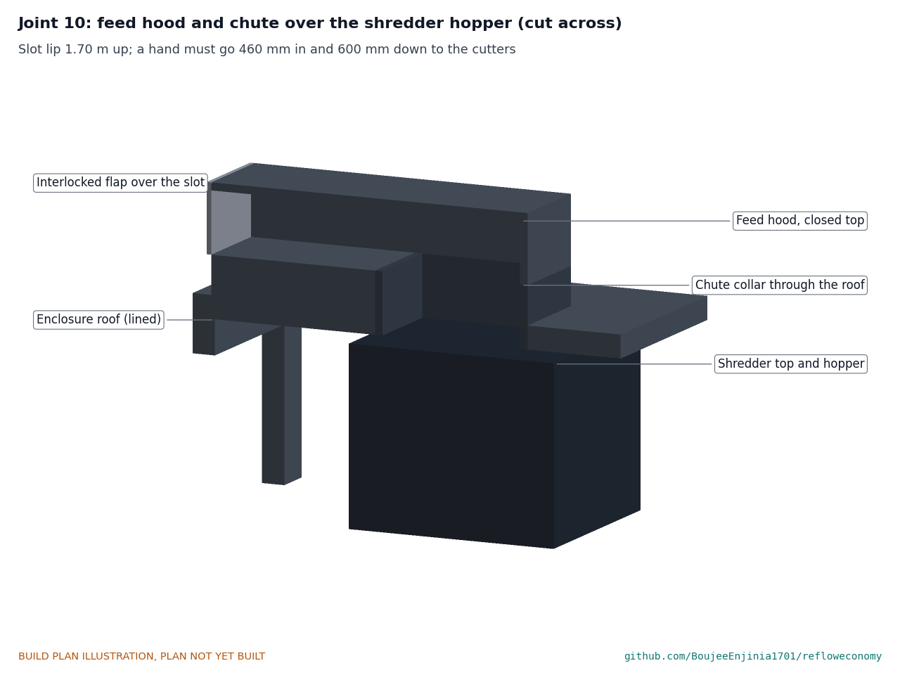

*Figure 28. Cut across: the collar goes through the roof over the hopper; a rubber skirt closes the 28 mm gap below it.*

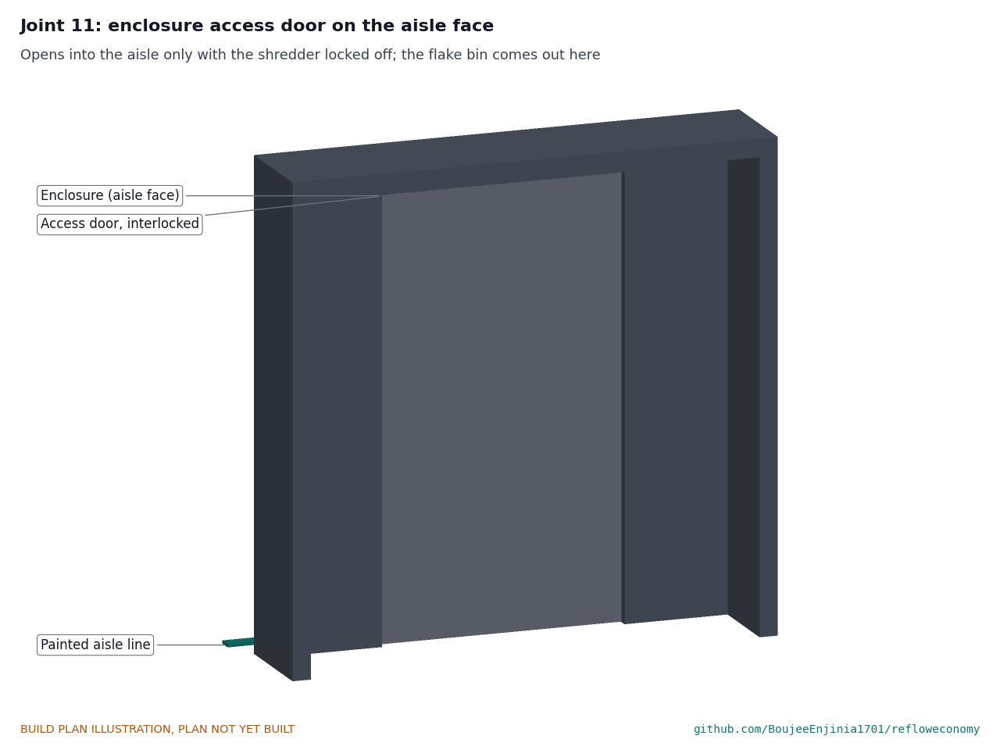

*Figure 29. The door opens into the aisle only with the shredder locked off; the flake bin comes out here.*

The panels bolt together at the corners round the shredder and stand on the floor at 5,800 to 7,400 along and 150 to 1,550 from the front wall, held by angle cleats screwed down at 600 pitch. They clear the shredder by 140 and 135 at the ends, 370 in front, 360 behind and 28 above. The collar sits in the roof hole with its mouth 1,700 above the floor. Both interlock switches are wired into the shredder's stop circuit by the electrician.

**Check before moving on.** Opening the lid, or the door, stops the rotor every time (stop S5).

### 3.17 Washing tanks and trap (bought)

Two 400 to 500 L polyethylene tanks (pre-wash and float-sink rinse) on level floor at 3,800 to 4,600 and 4,700 to 5,500 along, 300 to 1,000 from the front wall; a settling trap and a splash-rated 0.75 kW pump on a skid in front of them, 1,100 to 1,600 from the front wall. The pump plugs into a residual-current-protected socket fed from the front cable tray, above splash height. See step 17.

### 3.18 Drying rack and fan stand

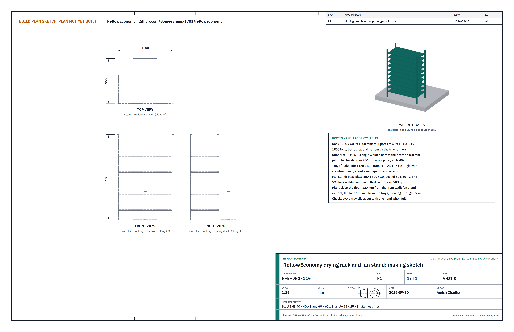

*Figure 30. Drying rack and fan stand making sketch (RFE-DWG-110).*

**What it is and what it is made from.** A rack of ten mesh trays (7.2 m² in all) for washed flake, and a stand for the 0.4 kW fan that blows through it. Steel square tube 40 x 40 x 3 and 60 x 60 x 3, angle 25 x 25 x 3, stainless mesh of about 2 mm aperture.

**How to make it.**

1. Cut four posts of 40 x 40 x 3 tube, 1,800 long, and set them out on a 1,200 x 600 rectangle.
2. Weld runners of 25 x 25 x 3 angle across the short sides at 160 pitch, ten levels from 200 up (the top tray sits at 1,640).
3. Make ten trays, each a 1,120 x 600 frame of 25 x 25 x 3 angle with mesh riveted in.
4. Fan stand: weld a 590 long post of 60 x 60 x 3 tube to a 500 x 300 x 10 base plate, with a plate on top to take the fan.

**How it fits the parts next to it.**

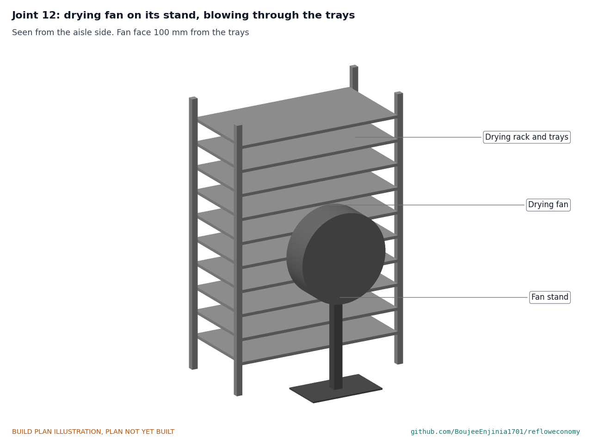

*Figure 31. Seen from the aisle side: the fan face is 100 mm from the trays.*

The rack stands on the floor at 7,700 to 8,900 along, 200 to 800 from the front wall. The fan bolts to the stand, axis 900 above the floor, blowing through the trays toward the front wall.

**Check before moving on.** Every full tray slides out with one hand.

### 3.19 Intake, racking and passport desk (bought)

- **Intake.** A 300 kg platform scale 1 x 1 m at 300 to 1,300 along; a steel sorting table 2.0 x 0.9 m, 900 high, from 110 to 1,010 from the front wall; four colour-coded bins 420 x 600 x 800 (PET, HDPE, PP, metals) behind it, 1,030 to 1,630 from the front wall, behind the aisle line (step 18).
- **Racking.** Two pallet racking bays 1.35 x 1.0 x 2.0 m with three levels, anchored to the floor: bay 1 (products) in the back row at 10,750 to 12,100 along, bay 2 (flake bags) in the front row at 9,100 to 10,450 along. Bay 1 is exactly 1.0 m from the hot zone line.
- **Passport desk.** A desk 1,100 x 700 at 10,800 to 11,900 along with a thermal label printer, a 30 kg bench scale, a moisture meter and a laptop or phone.

### 3.20 Export and residue cage

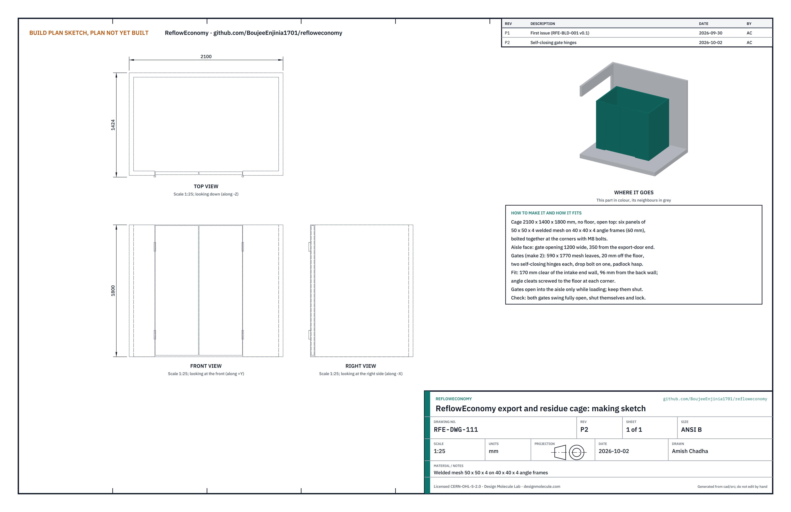

*Figure 32. Export and residue cage making sketch (RFE-DWG-111).*

**What it is and what it is made from.** A lockable cage by the export doors for metals, boards, cells and residue waiting to leave. Welded mesh 50 x 50 x 4 on frames of 40 x 40 x 4 angle.

**How to make it.**

1. Make six panels 1,800 tall: two sides 1,400 wide, a back 2,100 wide, and on the aisle face two panels either side of a 1,200 gate opening (350 and 550 wide).
2. Make two gate leaves 590 x 1,770 of the same mesh and angle, with two hinges each, a drop bolt on one and a padlock hasp on the other.
3. Drill the frames for M8 bolts at the corners.

**How it fits the parts next to it.**

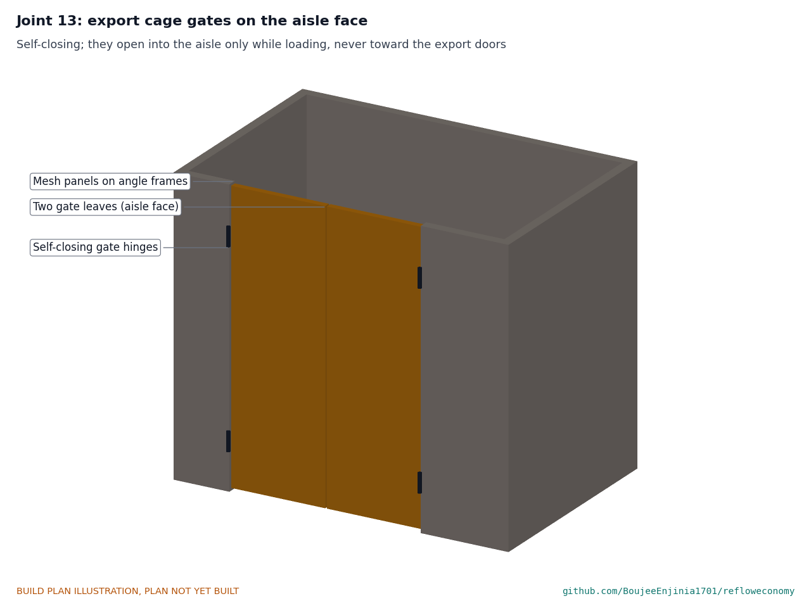

*Figure 33. The gates open into the aisle, not toward the export doors 170 mm away.*

The cage stands at 250 to 2,350 along and 3,300 to 4,700 from the front wall, no floor, open top, held by angle cleats at each corner. Inside go a fire-safe steel container with dry sand for lithium cells and the bale bags.

**Check before moving on.** Both gates swing fully open and lock shut.

### 3.21 Bought components

Buy to specification, not brand. Item numbers are those of the bill of materials.

- **Building shell (item 13).** A rented shed of about 60 m² with a concrete floor, or two used 40 ft containers with the seam work of section 3.1.
- **Intake (item 1), washing (item 2).** As sections 3.19 and 3.17.
- **Shredder (item 3).** As section 3.15.
- **Extruder (item 5), presses (item 6).** As sections 3.7 and 3.9; HDPE and PP only.
- **Fume extraction (item 7).** Duct, fittings, fan and filter box and stack as sections 3.13 and 3.14.
- **Racking (item 8), passport desk (item 9), safety station (item 10).** As sections 3.19 and 3.4; PPE for four workers (respirators, face shields, heat and puncture-resistant gloves, hearing protection, safety boots), first aid kit, sharps container.
- **Electrical board and tray (item 11).** As section 3.6, installed by a licensed electrician.
- **Fixings.** M8 bolts, nuts and washers; M8 and M10 rivet nuts; M10 concrete anchors; M6 countersunk wood screws; steel rivets; closed-cell foam strip; duct sealant and tape; rubber duct collar.

## 4. Putting it together

In each picture the parts already fitted are grey and the parts being fitted are in colour, with an arrow showing the way they go in.

### Step 1: seam beam in, then the side walls out (container option)

Containers on level footings, doors at the intake end. The fabricator props the roofs, fits the seam beam to the engineer's design, and only then cuts out the joining side walls and flashes the roof joint. **Hold point:** stop S1.

### Step 2: floor seam cover plate

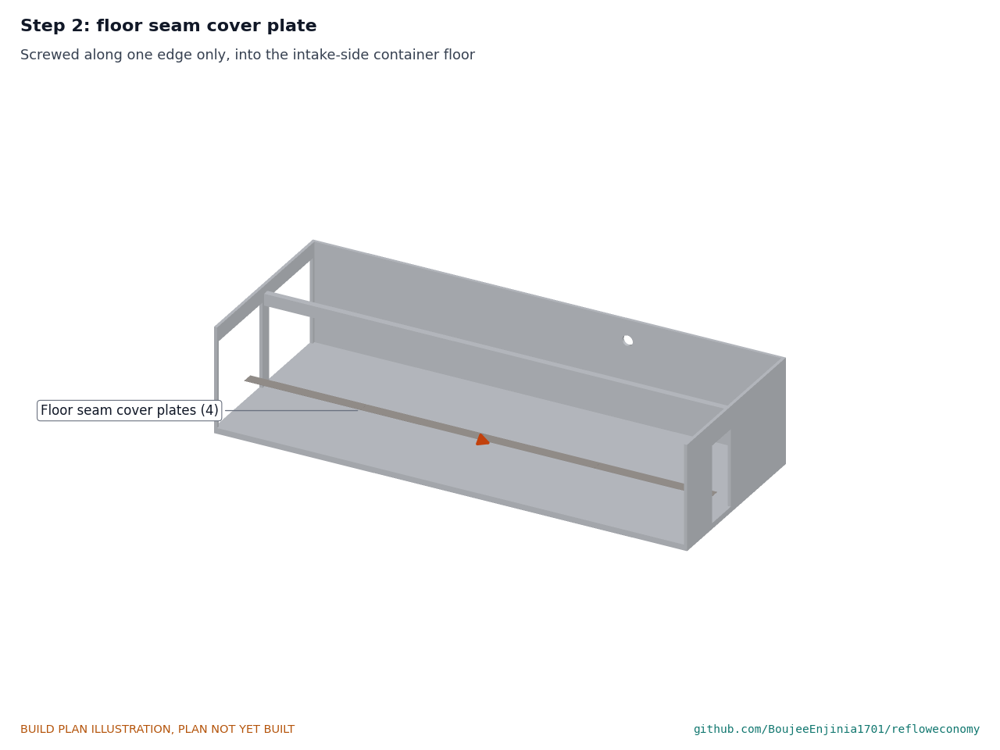

Four lengths, drilled edge over the intake-side container, M6 countersunk screws into that floor only.

### Step 3: paint the aisle lines and the hot zone boundary

Mark out from the front wall and the intake end wall as section 3.3; two coats.

### Step 4: safety station first

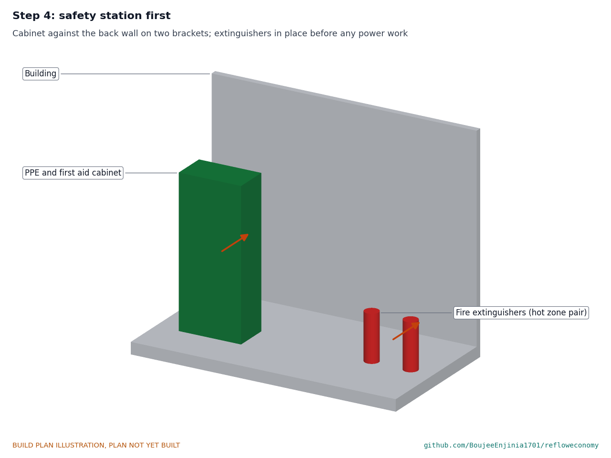

Cabinet against the back wall on two brackets; the two hot zone extinguishers on their stands. These are in place before any power or hot work.

### Step 5: backboard onto the back wall

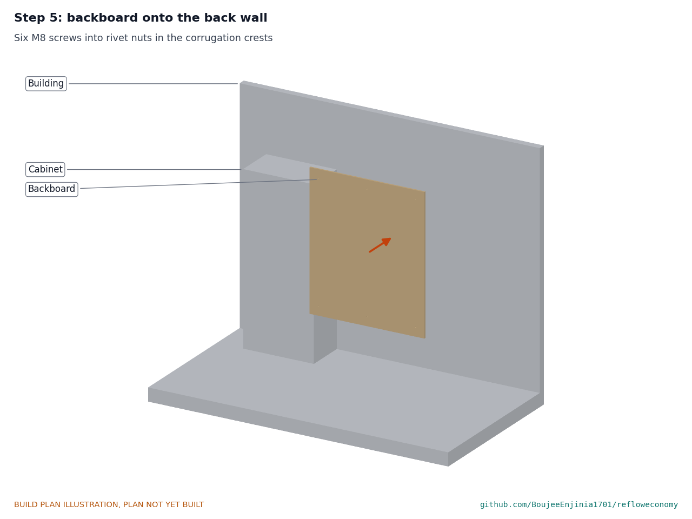

Six M8 screws into rivet nuts in the corrugation crests.

### Step 6: eyewash and electrical board onto the backboard

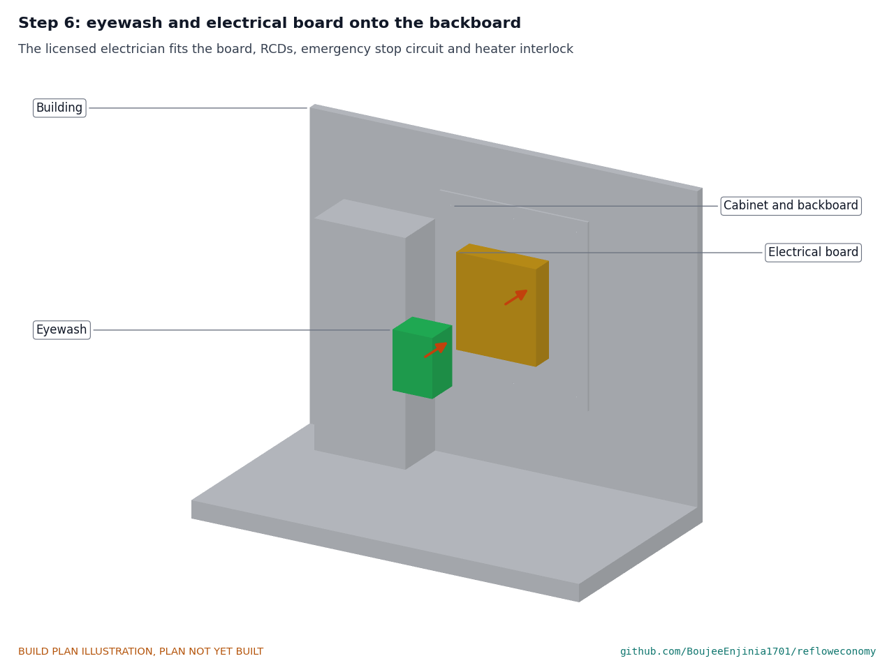

The electrician fits the board with its residual current devices, emergency stop circuit and heater interlock; the eyewash bracket screws to the backboard beside it.

### Step 7: cable tray

Spacers, then the back run, the crossing under the seam beam on two beam clamps, and the front run. **Hold point:** stop S2.

### Step 8: extruder into the hot zone

Levelled on its feet, barrel along the line, hopper toward the intake end.

### Step 9: hood B onto the extruder frame

Lowered over the barrel so the barrel passes through the end hole; six M8 bolts through the bottom flange.

### Step 10: presses and transfer bridge

Both presses in place and levelled before the booth goes up; the bridge bolted to the hot press frame, its roller level with both platens.

### Step 11: press booth round the presses

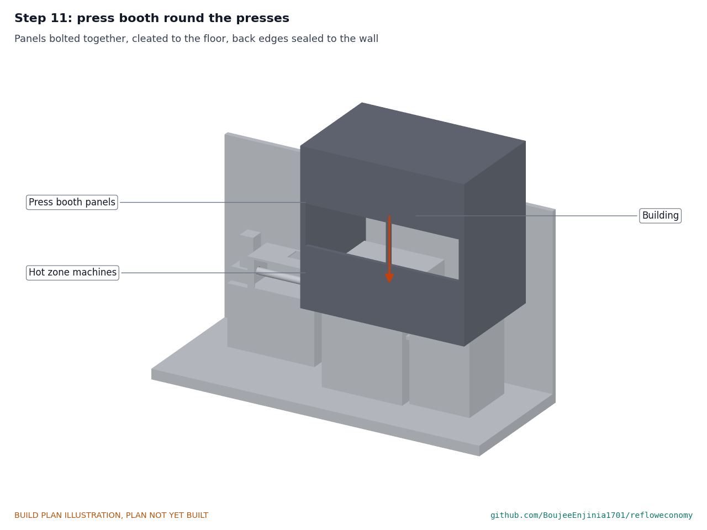

Ends first, then the front, then the roof, all bolted through their frames; cleats screwed to the floor; back edges on foam against the wall.

### Step 12: sash rails and the sliding sash

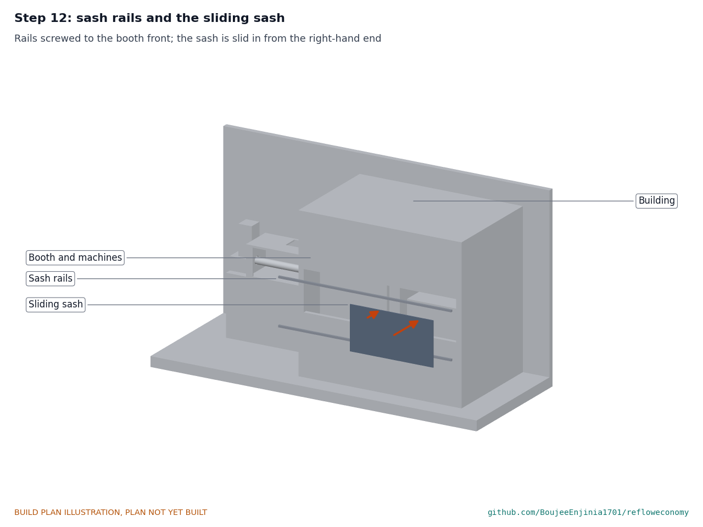

Rails screwed to the booth front; the sash slid in from the right-hand end; end stops fitted.

### Step 13: duct, brackets, booth take-off and wall sleeve

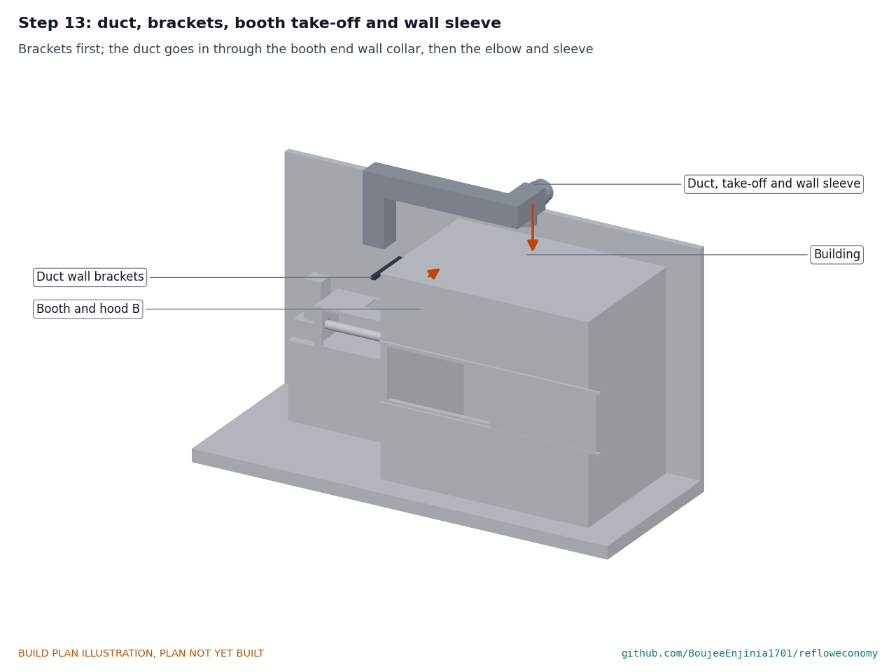

Brackets first; riser onto the hood B spigot; the run through the booth end wall collar onto the brackets; the elbow with its take-off; the sleeve through the back wall. Every joint sealed.

### Step 14: fan stand, fan and filter box, stack (outside)

Seen from behind. Stand anchored to its pad; fan box bolted on and joined to the sleeve; stack on the outlet, 1 m above the roof.

### Step 15: shredder in place

Levelled; its emergency stop and drive wired from the front tray by the electrician.

### Step 16: acoustic enclosure, door and feed chute

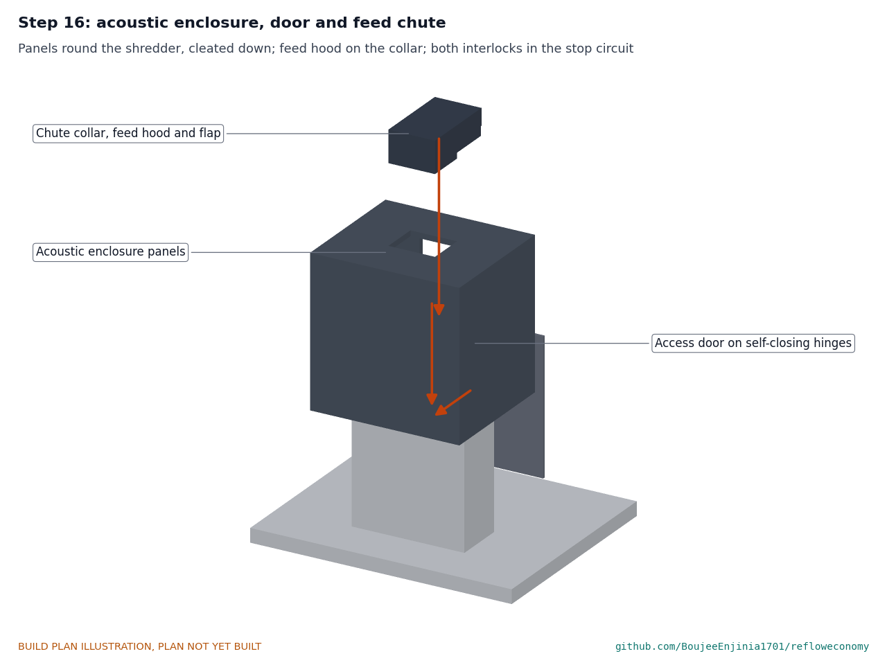

Wall panels bolted together round the shredder and cleated down, then the roof, the collar and lid, and the door. Both interlocks wired into the stop circuit. **Hold point:** stop S5.

### Step 17: washing tanks, drying rack and fan

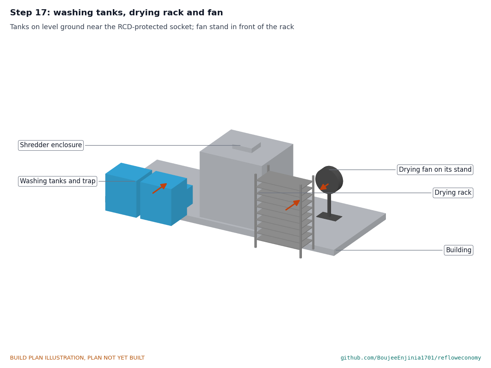

Tanks and pump skid on level floor; rack on the floor 120 from the front wall; fan stand in front of it.

### Step 18: intake scale, sorting table and bins

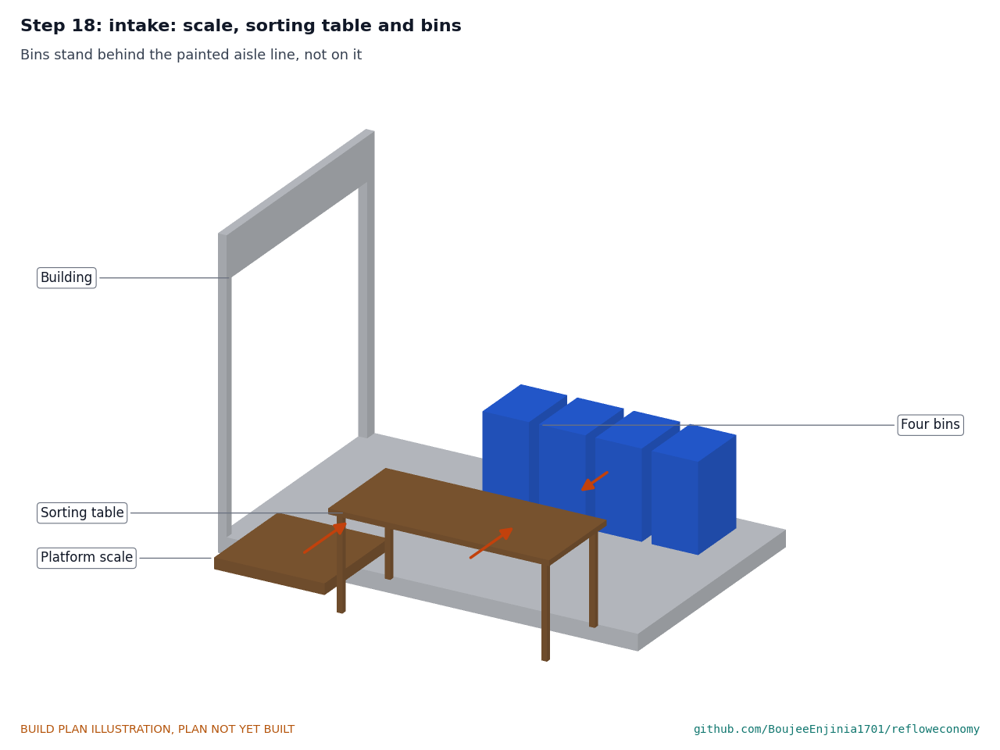

Scale inside the intake doors; table and bins behind the aisle line.

### Step 19: racking, passport desk and the last extinguisher

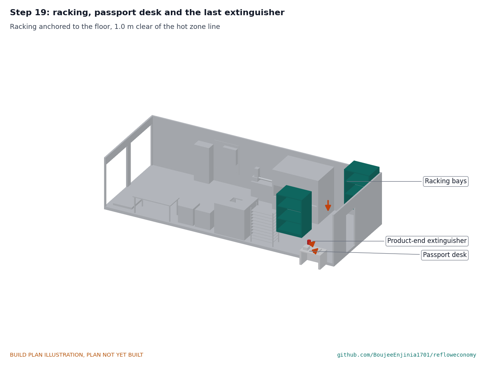

Racking anchored to the floor, bay 1 exactly 1.0 m from the hot zone line; desk at the product end; the third extinguisher beside the aisle.

### Step 20: export and residue cage

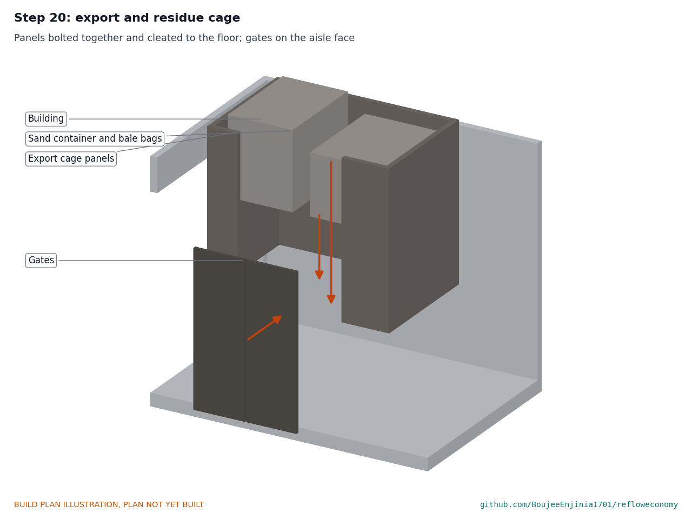

Panels bolted together and cleated down; gates on the aisle face; sand container and bale bags inside.

## 5. First checks

These are the checks a TRL 4 test report would record; this plan only lists them. Requirement numbers are those of RFE-REQ-001.

*Table 2. First checks.*

| Check | Requirement | How | Pass when |
| --- | --- | --- | --- |
| Floor area and aisle | R5 | Tape measure along the aisle and between rows | Clear aisle 1.0 m or more everywhere (1.57 m by design); nothing stands on the painted lines |
| Headroom over the aisle | R5 | Measure under the tray crossing and the seam beam | 2.0 m or more (2.04 m by design) |
| Hot zone clearance | R5 | Measure from the boundary line to the nearest stock | 1.0 m or more |
| Residual current devices | R12 | Trip test on every circuit, by the electrician | Each trips within its rated time at 30 mA |
| Heater interlock | R12 | Run the shredder, then try to switch on the press heaters; repeat with the extruder | The press heaters cannot switch on while either motor runs |
| Shredder interlocks and stop | R12 | Open the chute lid, then the door, then press the emergency stop, each with the rotor running empty | The rotor stops each time and does not restart until reset |
| Hood face velocity | R11 | Vane anemometer across opening 1 (sash over opening 2), opening 2 (sash over opening 1) and the hood B face, fan running, filters new | 0.5 m/s or more averaged over each opening |
| Sash | R11 | Slide it end to end | It covers each opening with 25 mm or more to spare and cannot leave both open |
| Shredder noise | R12 | Sound level meter 1 m from the enclosure, shredder running on HDPE | Recorded; the area stays a hearing protection zone until this is known |
| Energy per shift | R9 | Read the board's energy meter over a full reference shift | Recorded against 42.9 kWh |
| Passport at the desk | R13, R15 | Issue a passport for a test lot and time it | A valid record and label in 2 min or less |

## 6. Safety stops

Stop at each point. Carry on only when everything listed is true.

- **S1. Before any container wall is cut.** The structural engineer's design and sequence are on site; the roofs are propped as it says; the seam beam is in and fixed. Nobody stands under a wall being cut.
- **S2. Before the supply is connected.** The electrician has installed and tested the board, the residual current devices, the emergency stop circuit and the heater interlock, and issued the installation certificate. Every socket near the washing tanks is residual-current protected and above splash height.
- **S3. Before any motor runs.** Guards on, emergency stops within reach of each machine, lockout padlocks and tags for every isolator, hearing protection at the shredder.
- **S4. Before any heater is switched on.** The fan runs; the face velocity at each opening has been measured at 0.5 m/s or more; the heater interlock has been tested; the two hot zone extinguishers are in place; nothing combustible is inside the hot zone line. Extraction runs whenever a heater is on and for 30 minutes after.
- **S5. Before the shredder takes material.** The lid and door interlocks stop the rotor every time; the intake rules are in force: no lithium cells, sharps, chemical containers or PVC in the feed; cells found at intake go straight into the sand container.
- **S6. Before the first melt.** Only identified HDPE and PP go into the extruder or press; PVC, polystyrene, PET and unknown plastics are never heated. Heat-resistant gloves and face shields are worn at the presses.
- **S7. Before anyone works a shift in it.** A qualified safety professional has reviewed the finished layout, the exits and the headroom against the local code; workers are trained and none is under 18.

## 7. Tools, skills and workspace

**Tools.** Angle grinder with cutting and flap discs; metal-cutting chop saw or bandsaw; MIG or stick welder with screens; bench drill and a magnetic drill or heavy hand drill; drills 3 to 13 mm and a countersink; rivet nut tool (M8 and M10); hand rivet tool; sheet metal shears and a folder for 1.5 mm sheet; jigsaw with a metal blade; hammer drill and anchor setting tool; spanners and sockets to M10; tape measure, chalk line, square and spirit level; floor paint rollers; vane anemometer; sound level meter; stopwatch. The electrician brings their own test instruments.

**Skills.** Structural steel welding to the engineer's drawings (a certified welder for the seam beam); general metalwork (marking out, cutting, drilling, welding light angle and tube, riveting and folding sheet); a licensed electrician for everything on the supply side; safe lifting with a crew or a pallet truck for the machines.

**Workspace.** The shell itself, with the doors open for ventilation while welding and painting; a welding area with screens and a fire watch for 30 minutes after hot work; level hard standing outside the back wall for the fan stand.

**Personal protective equipment.** Safety glasses and boots throughout; welding helmet, gloves and jacket; cut-resistant gloves for sheet and mesh; hearing protection for cutting and grinding; a hard hat while the roof is propped.

## 8. Where the numbers come from

- Model and constructability checks: `cad/src/model.py` (`python cad/src/model.py --check`); STEP and STL exports in `cad/step/` and `cad/stl/`.
- Pictures: `cad/src/build_plan_media.py`, using `.kit/build_views.py`; written to `docs/05-build-plan/` and `cad/drawings/RFE-DWG-101` to `RFE-DWG-111`.
- General arrangement: `cad/drawings/RFE-DWG-001.pdf`, Rev P3.
- Calculations: `docs/04-calcs/01-sizing.md` (RFE-CAL-001 v0.3) and `docs/04-calcs/sizing.py`: layout and aisle (section 8), hoods and fan (section 6), noise (section 7), equipment cost (section 9).
- Bill of materials: `bom/bom.csv` and `bom/bom-notes.md`.
- Decisions: `docs/decisions/0003-design-for-construction.md` (RFE-DDR-003), with RFE-DDR-001 and RFE-DDR-002; open decisions in `docs/06-design-decisions.md` (RFE-DEC-001).
- Requirements: `docs/03-requirements.md` (RFE-REQ-001 v0.5).
